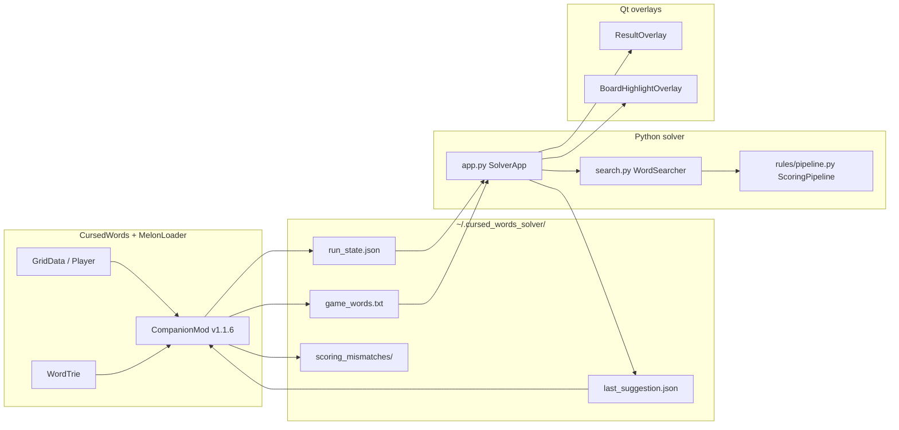

# Cursed Words Solver

Desktop assistant for **Cursed Words: The Word Game That Isn't**. Press a hotkey to find the highest-scoring valid word on the current 5×5 board and show where to click.

Requires the [MelonLoader companion mod](melmod/README.md), which reads the live board, loadout, and game dictionary from game memory into `run_state.json`.

## Capabilities

- Time-budgeted word search with curse-aware paths (teleports, rook/queen lines, wildcards, number tiles)
- Scoring that follows the official [wiki order](https://cursedwords.wiki.gg/wiki/Scoring) (tiles → boss tile/word penalties → grid → pin → stickers → stamps), driven by `[data/wiki/stickers.json](data/wiki/stickers.json)`
- Always-on-top result overlay plus numbered, click-through path highlights on the game board
- Scoring mismatch capture (melmod v1.1.6+) and regression fixtures from real in-game submits

## Quick start

### Python solver

From the **repository root** (the folder that contains `pyproject.toml` and `requirements.txt`):

```bash
python -m venv .venv
.venv\Scripts\activate
pip install -r requirements.txt
pip install -e .
```

Do not `cd` into the inner `cursed_words_solver/` package folder for setup — that directory is only the Python source, not the installable project.

Run the app:

```bash
python -m cursed_words_solver.app
# or, after install:
cursed-solver
```

### MelonLoader + companion mod (required)

Close Cursed Words, then from the repo root in PowerShell:

```powershell
.\melmod\install-melonloader.ps1
.\melmod\build.ps1
```

Steam default path: `C:\Program Files (x86)\Steam\steamapps\common\Cursed Words\`. Use `-GameDir` on either script if your install is elsewhere. Launch the game **once** from Steam after MelonLoader installs, then start a run and press **F7** before solving. Full install steps and JSON field reference: `[melmod/README.md](melmod/README.md)`.

## How it works

The game, mod, solver, and overlays communicate through files under `%USERPROFILE%\.cursed_words_solver\` — there are no network sockets or injected Python into the game process.



### Game data extraction (melmod)

`[CompanionMod.cs](melmod/CursedWordsSolverCompanion/CompanionMod.cs)` runs inside the game via MelonLoader.

- **Auto-export:** When loadout or board changes, `[RunStateExporter.cs](melmod/CursedWordsSolverCompanion/RunStateExporter.cs)` computes a fingerprint and writes `run_state.json` (debounced ~0.5s).
- **Manual refresh:** Press **F7** in-game to force an immediate export and refresh `game_words.txt` via `[DictionaryExporter.cs](melmod/CursedWordsSolverCompanion/DictionaryExporter.cs)`. Melmod also auto-exports when the board or loadout fingerprint changes (~0.5s). **F8** alone is usually enough; F7 is a force refresh if export lags (e.g. right after receiving Sandy consumables).
- **Exported data:** Character, stickers, stamps, boss, pin, money, and `extras.*` (pin levels, boss area, hyena block, sticker-specific counters, etc.). The live board comes from `GridData` — up to 25 tiles with `char`, `base_score`, `color`, `curse`, `active`, plus `rows`/`cols` for Bat shrunk grids. The full vocabulary comes from the game `WordTrie`.
- **Scoring feedback:** After you press **F8** in the solver, `[suggestion.py](cursed_words_solver/suggestion.py)` writes `last_suggestion.json` (scoring word, path, board/loadout fingerprints, `predicted_trace`). When you submit that word on the same path, Harmony hooks compare the game’s score to the prediction; mismatches land in `scoring_mismatches/`. See [melmod README — scoring mismatch capture](melmod/README.md#scoring-mismatch-capture-v116). `last_suggestion.json` persists across solver restarts; on startup the solver clears it when the loadout changed (new character/run) and otherwise prints a note if the board differs from the last F8. Press **F8** to refresh before submitting — melmod also warns at submit time if the board changed mid-round.

Field-by-field JSON documentation: `[melmod/README.md](melmod/README.md)`. Do not bind **F8** in the mod — that hotkey belongs to the solver.

### Solver pipeline (Python)

Pressing **F8** starts `_solve_worker` in `[app.py](cursed_words_solver/app.py)` on a background thread (UI updates are posted back to the Qt main thread via `_HotkeyBridge` signals).

1. **Reload state** — Read `run_state.json` via `[loadout.py](cursed_words_solver/loadout.py)` (`load_run_state`, `parse_board_from_run_state`).
2. **Board** — Re-read `run_state.json` on every F8 via `[loadout.py](cursed_words_solver/loadout.py)`. F8 fails with a clear message if the board is missing (press **F7** in-game). When consumables are on the rack but `consumable_rack` has not been exported yet, the solver waits briefly for melmod auto-export (Sandy Saguaro fights and any character with rack tiles). After the baseline word search, it simulates rack placements for any character with unplaced consumables and adopts them only when they improve the best score (Sandy Saguaro boss fights use mandatory placement-first search instead). When rack placement improves the best score, amber dashed circles on the board overlay mark where to place consumables before tracing the green word path; orange numbered circles on the consumable rack mark which slot to use (same step numbers as the path).
3. **Dictionary** — `[dictionary.py](cursed_words_solver/dictionary.py)` loads `game_words.txt` when present (from melmod), else ENABLE1 (`[config.py](cursed_words_solver/config.py)` `resolve_wordlist`).
4. **Search** — `[search.py](cursed_words_solver/search.py)` `WordSearcher.find_best_words` runs DFS over active tiles with curse-specific neighbors (standard adjacency, double-letter teleports, chess piece rules, wildcards). Chess movement follows [wiki rules](https://cursedwords.wiki.gg/wiki/Curses#Chess_pieces): piece-specific rays, same-color blocking, pawn forward/double/capture, en passant, and king cannot move into check — see `[chess_tiles.py](cursed_words_solver/rules/chess_tiles.py)`. With **Hungry Snake** (`horizontal_wrap`), col 0 and col 4 connect on each row for letter steps and for chess checks/sliding rays. `PathValidator` prunes invalid prefixes and enforces stamp-specific rules. Search is time-budgeted (`search_time_budget_sec`) with fair per-start slices; extra passes cover void/number words on boards with NUMBER tiles. Boss limits (e.g. Wolf max length, Hyena block) come from `[boss_effects.py](cursed_words_solver/rules/boss_effects.py)`.
5. **Score** — Each candidate is scored by `[ScoringPipeline](cursed_words_solver/rules/pipeline.py)` using rules from `[data/wiki/stickers.json](data/wiki/stickers.json)` (`[rule_lookup.py](cursed_words_solver/rules/rule_lookup.py)`): base tile sum → Salamander/Robo-Monkey (boss) → grid path bonuses → pin → stickers → stamps, matching [wiki order](https://cursedwords.wiki.gg/wiki/Scoring).
6. **Output** — Top `top_n_results` words are kept; the best is re-scored with a full trace, written to `last_suggestion.json` (with `export_diagnostics`, `export_warnings`, `solver_session_extras`), and debug JSON under `debug/parse_*.json`.

### Display layer (overlays)

Melmod provides *what* is on each tile and **automatic overlay alignment** via `ui_layout` in `run_state.json` (board + consumable rack screen bounds from Unity). Manual F10 calibration is a fallback when `ui_layout` is missing.

- **Result panel** — `[overlay.py](cursed_words_solver/ui/overlay.py)`: frameless, always-on-top widget in the **second column from the left**. Shows the best word and score, warnings, and an optional thumbnail from the last board capture.
- **On-board path** — `[board_highlight.py](cursed_words_solver/ui/board_highlight.py)`: transparent, click-through window aligned to the melmod board bounds. Numbered green circles and a connecting line mark the click order (`path_geometry`). Amber dashed circles mark consumable placement cells on the grid before tracing the path.
- **Consumable rack** — `[rack_highlight.py](cursed_words_solver/ui/rack_highlight.py)`: transparent overlay aligned to melmod rack bounds. Orange numbered circles mark which rack slot to drag for each path step (same numbers as the green path — disambiguates duplicate letters).
- **Automatic layout** — `[UiLayoutExporter.cs](melmod/CursedWordsSolverCompanion/UiLayoutExporter.cs)` exports `ui_layout` on each F7/auto-export. Python reads it via `[ui/layout.py](cursed_words_solver/ui/layout.py)` on every F8.
- **Manual calibration (fallback)** — **F10** runs `[ui/calibrate.py](cursed_words_solver/ui/calibrate.py)` when melmod layout is unavailable.
- **Auto-clear** — When melmod is active, highlights watch board/loadout [fingerprints](cursed_words_solver/fingerprints.py) and clear on shop entry or a new round. Press **ESC** to hide manually.

## Hotkeys

| Key          | Where                 | Action                                                 |
| ------------ | --------------------- | ------------------------------------------------------ |
| F7           | In-game               | Force melmod export (board, loadout, `game_words.txt`) |
| F8           | Solver (configurable) | Solve                                                  |
| F9           | Solver                | Edit loadout manually                                  |
| F10          | Solver                | Manual overlay calibration (fallback if ui_layout missing) |
| ESC          | Solver                | Hide overlay and board highlights                      |
| Ctrl+Shift+Q | Solver                | Quit                                                   |

## Usage

1. **Melmod** — Install (see [Quick start](#melonloader--companion-mod-required)), start a run, press **F7** once so `run_state.json`, `ui_layout`, and `game_words.txt` exist.
2. **Solve** — **F8**. Terminal shows `Board from melmod` and `Overlay layout: melmod (auto)`. Green path circles and orange rack circles align automatically.
3. **Manual fallback** — If `ui_layout` is missing (old melmod), use **F10** to drag board + rack regions once.
4. **Quit** — **Ctrl+Shift+Q** or close the overlay. Ctrl+C often fails while global hotkeys are active.
5. **Recalibrate** — **F10** only when auto layout is unavailable; preview at `%USERPROFILE%\.cursed_words_solver\debug\calibration_preview.png`.

Press **F9** to edit loadout manually if needed. Without `game_words.txt`, the solver falls back to ENABLE1 until you press **F7** in-game.

## Runtime files

All paths under `%USERPROFILE%\.cursed_words_solver\`:

| File / folder                            | Written by       | Read by                                                       |
| ---------------------------------------- | ---------------- | ------------------------------------------------------------- |
| `config.json`                            | Solver           | Solver                                                        |
| `run_state.json`                         | Melmod           | Solver                                                        |
| `game_words.txt`, `game_words_meta.json` | Melmod           | Solver                                                        |
| `last_suggestion.json`                   | Solver (each F8) | Melmod (scoring capture)                                      |
| `scoring_mismatches/`                    | Melmod           | You → `scripts/mismatch_to_test.py`                           |
| `debug/`                                 | Solver           | You (parse traces, board captures, export warnings)           |
| `export_audit.jsonl`                     | Melmod (verbose) | Per-export audit trail                                        |

## Project layout

```text
cursed_words_solver/   # Python package
  app.py               # Hotkeys, solve orchestration, Qt bridge
  search.py            # Word search (DFS, time budget, boss limits)
  loadout.py           # run_state.json → Board / Loadout
  dictionary.py        # game_words.txt / ENABLE1
  suggestion.py        # last_suggestion.json for melmod
  fingerprints.py      # Board/loadout change detection
  rules/               # Scoring pipeline, bosses, rule lookup
  board_display.py     # ASCII grid formatting for logs
  ui/                  # Result overlay, board highlights, calibration, loadout dialog
melmod/                # MelonLoader companion (C#) + install/build scripts
data/wiki/             # stickers.json catalog + wiki scrape inputs
scripts/               # build_stickers_json, mismatch_to_test — see scripts/README.md
tests/                 # catalog/, integration/, regression/, unit tests
.github/workflows/     # CI (pytest on push/PR)
```

## Config

Stored at `%USERPROFILE%\.cursed_words_solver\config.json`:

| Key                      | Default  | Purpose                                                                                    |
| ------------------------ | -------- | ------------------------------------------------------------------------------------------ |
| `board_region`           | —        | Manual fallback `{x, y, width, height}` when melmod `ui_layout` is absent                  |
| `rack_region`            | —        | Manual fallback consumable rack row (five equal slots)                                     |
| `show_board_highlight`   | `true`   | Numbered circles on the game board and consumable rack                                     |
| `hotkey`                 | `f8`     | Solve hotkey                                                                               |
| `search_time_budget_sec` | `45`     | Seconds per solve for word search. Legacy values `2` / `15` / `30` auto-upgrade on startup |
| `top_n_results`          | `3`      | Alternate words shown in the overlay                                                       |
| `wordlist`               | `game`   | `game` → `game_words.txt`; `enable1` → offline fallback                                    |
| `setup_weight`           | `0.4`    | Weight for future-round setup value in search ranking                                      |
| `search_workers`         | `"auto"` | Parallel DFS processes: `"auto"` (up to 8 cores), `1` to disable, or integer `2`–`16`      |

On startup the terminal prints the loaded word list, e.g. `Word list: game (120000 words)`. After each solve it prints the grid and `Board source: melmod`.

Word length is derived automatically per solve: minimum is 1, maximum is the active board size (up to 25), then boss effects (for example Cobra/Wolf) clamp that range.

### Search performance

- **Melmod board (F7)** — Exact tiles avoid wasted DFS branches; refresh before **F8**.
- **Game wordlist** — **F7** exports `game_words.txt` for tighter dictionary pruning than ENABLE1.
- **`search_time_budget_sec`** — Main knob for more candidates within a time limit.
- **`search_workers`** — Set to `"auto"` or `4` to partition DFS by start cell across processes (helps CPU-bound search; sticker scoring still dominates on heavy loadouts).
- **Curse-heavy boards** — Teleports, chess pieces, and wildcards branch heavily; wildcards are searched first. Raise the time budget on dense boards if needed.

### Troubleshooting

- **Wrong words with melmod** — **F7** in-game, then **F8** again; check `run_state.json` has a `board` with 25 tiles.
- **F8 does nothing** — Install/rebuild melmod, start a run, press **F7**, then **F8** again.
- **Overlay stuck on “Press F8 to solve”** — Restart the solver; check the terminal for `Done in … Best: WORD` after **F8**.
- **No on-board highlights** — `show_board_highlight` true and **F10** region matches the live grid; melmod does not position highlights without calibration.
- **No board in JSON** — Export only runs mid-run (not main menu).
- **Invalid word suggestions** — Rebuild melmod, **F7** during a run, confirm `game_words.txt` exists. `enable1 fallback` means the game dictionary was not exported.
- **Birthday Cake shows 0** — Set `extras.birthday_cake_bonus` in `run_state.json` (press **F7** after rebuilding melmod, or edit manually to match the sticker UI).
- **Movie Camera shows 0 + …** — Set `extras.movie_camera_word_score_bonus` in `run_state.json` to the sticker’s current “Get +X WORD SCORE” value (press **F7** after rebuilding melmod, or edit manually).
- **Lucky Dice off by +50** — Rebuild melmod, press **F7** in-game, confirm `run_state.json` → `extras.target_number` is set (not `lucky_dice_target_missing`). Without it the solver skips the +50 word bonus.

### Scoring calibration (predicted vs in-game)

With melmod companion **v1.1.6+**:

1. **F7** in-game, then **F8** in the solver — writes `last_suggestion.json` with `predicted_trace`.
2. Play the suggested word on the **highlighted path** before the board changes.
3. On score mismatch, the mod saves `scoring_mismatches\<timestamp>.json`.
4. Add a regression fixture: `python scripts/mismatch_to_test.py <path-to-mismatch.json>` → `tests/fixtures/mismatches/<id>.json`, then `pytest tests/regression/ -k <id>`.

**Lucky Dice** needs `extras.target_number` (the grid’s chosen number tile value). Hayley’s Lucky Dice sticker adds **+50 WORD SCORE** when your word contains that number. If predictions are low by exactly 50 with Lucky Dice equipped, press **F7** after rebuilding melmod so `target_number` is exported; the companion also sets `lucky_dice_target_missing` when it cannot read the target. Mismatch replay can infer a missing target from `actual_trace` when Lucky Dice clearly fired.

Rebuild after pulling solver changes: `.\melmod\build.ps1`. Details: `[melmod/README.md](melmod/README.md#scoring-mismatch-capture-v116)`, `[melmod/SCORING_HOOKS.md](melmod/SCORING_HOOKS.md)`.

## Sticker rules catalog

Rules follow the official [Scoring](https://cursedwords.wiki.gg/wiki/Scoring) order. Canonical lists: [pins](https://cursedwords.wiki.gg/wiki/List_of_pins), [stickers](https://cursedwords.wiki.gg/wiki/List_of_stickers), [stamps](https://cursedwords.wiki.gg/wiki/List_of_stamps).

`[data/wiki/stickers.json](data/wiki/stickers.json)` maps wiki IDs (with aliases for mod `ArtFileName` mismatches). Pin rules use **art slug** via `extras.pin_effect` in `run_state.json`.

**Main Bosses** ([wiki](https://cursedwords.wiki.gg/wiki/Bosses)): scoring bosses use `boss_id` plus `extras.boss_area_number` (1–5) and `extras.boss_cursed`. Hyena sets `hyena_blocked`. Bat exports `rows`/`cols` and `active: false` on off-board cells. Rebuild melmod and **F7** after companion updates.

Regenerate the catalog (see also `[scripts/README.md](scripts/README.md)`):

```bash
curl -s "https://cursedwords.wiki.gg/api.php?action=query&list=categorymembers&cmtitle=Category:Stickers&cmlimit=500&format=json" -o data/wiki/_stickers_raw.json
curl -s "https://cursedwords.wiki.gg/api.php?action=query&list=categorymembers&cmtitle=Category:Stamps&cmlimit=500&format=json" -o data/wiki/_stamps_raw.json
curl -s "https://cursedwords.wiki.gg/api.php?action=query&list=categorymembers&cmtitle=Category:Bosses&cmlimit=50&format=json" -o data/wiki/_bosses_raw.json
curl -s "https://cursedwords.wiki.gg/api.php?action=query&list=categorymembers&cmtitle=Category:Characters&cmlimit=50&format=json" -o data/wiki/_chars_raw.json
python scripts/build_stickers_json.py
```

## Development and tests

```bash
pip install -e ".[dev]"
pytest tests/                    # default: excludes @slow (matches CI)
pytest tests/ -m slow            # search benchmarks only
pytest tests/regression/         # scoring mismatch fixtures
```

GitHub Actions runs `pytest tests/` on push and pull request to `main` / `master` (`[.github/workflows/test.yml](.github/workflows/test.yml)`).

| Test area   | Location             | Purpose                                                   |
| ----------- | -------------------- | --------------------------------------------------------- |
| Catalog     | `tests/catalog/`     | Per-character sticker/stamp scoring rules                 |
| Integration | `tests/integration/` | Melmod fingerprints, score traces, loadout scoring        |
| Regression  | `tests/regression/`  | Real mismatch captures under `tests/fixtures/mismatches/` |
| Unit        | `tests/test_*.py`    | Search, bosses, dictionary, path geometry, etc.           |

**Contributing a scoring fix:** F7 → F8 → play the highlighted word → collect mismatch JSON → `python scripts/mismatch_to_test.py …` → fix pipeline → `pytest tests/regression/ -k <fixture_id>` until green → remove that id from `_KNOWN_FAILING` in `[tests/regression/test_scoring_mismatches.py](tests/regression/test_scoring_mismatches.py)`.

New mismatch fixtures are **not** added to `_KNOWN_FAILING` by default, so CI fails until the replay passes (or you deliberately quarantine a case). Passing regressions (~54) still run on every `pytest tests/`.

## Related documentation

- `[melmod/README.md](melmod/README.md)` — MelonLoader install, `run_state.json` schema, boss/pin extras
- `[melmod/SCORING_HOOKS.md](melmod/SCORING_HOOKS.md)` — Harmony hook points for score capture
- `[scripts/README.md](scripts/README.md)` — Maintenance scripts (`build_stickers_json`, `mismatch_to_test`)
