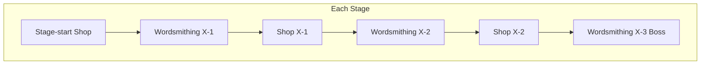
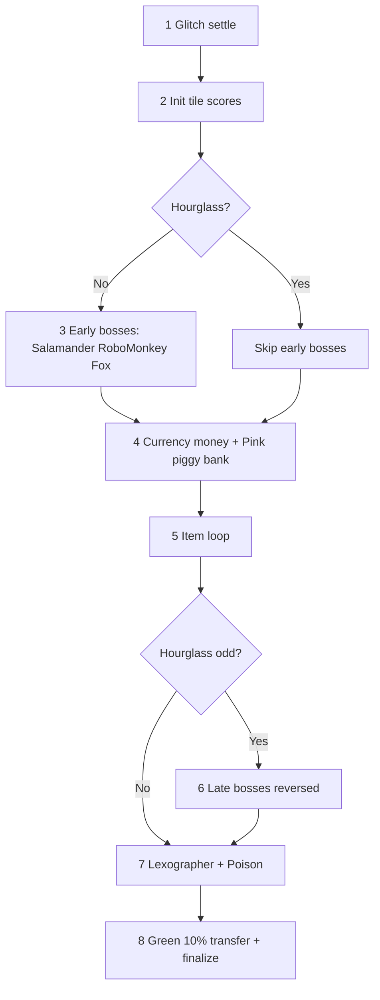

# Cursed Words: Comprehensive Game Guide

> **Last updated:** June 2026  
> **Sources:** [Cursed Words Wiki](https://cursedwords.wiki.gg/), decompiled game research (`docs/game-research/`), catalog (`data/wiki/stickers.json`).  
> **Spoiler warning:** Bosses, hidden characters, Michael, and endgame mechanics.

---

## Table of Contents

1. [Introduction](#1-introduction)
2. [Run Structure and Progression](#2-run-structure-and-progression)
3. [Word Submission and Path Rules](#3-word-submission-and-path-rules)
4. [Scoring System](#4-scoring-system)
5. [Tiles Reference](#5-tiles-reference)
6. [Items System](#6-items-system)
7. [Bosses](#7-bosses)
8. [Shop and Economy](#8-shop-and-economy)
9. [Difficulty: Crowns](#9-difficulty-crowns)
10. [Challenges, Quests, and Meta](#10-challenges-quests-and-meta)
11. [Michael Boss](#11-michael-boss)
12. [Appendix](#12-appendix)

---

## 1. Introduction

**Cursed Words: The Word Game That Isn't** is a roguelike word-building game developed by **Buried Things**. You trace paths across a letter grid to form valid dictionary words, accumulate score, and beat target thresholds across a multi-stage run. Over time, tiles stop being mere letters—they become numbers, chess pieces, currencies, playing cards, and the infinite void.

Each run is shaped by four pillars:

| Pillar | Role |
|--------|------|
| **Character (Pin)** | Unique dual-track upgrade; left = grid, right = scoring |
| **Stickers** | Up to 5 primary modifiers; reorderable; upgradeable (level 3, foil 5) |
| **Stamps** | Up to 5 secondary modifiers; fixed level; movement and shop effects |
| **Tiles / Consumables** | Coloured and cursed grid tiles; placeable consumables in special fights |

Structurally similar to *Balatro*: shops between encounters, synergistic builds, escalating difficulty, boss modifiers. Score is a **combinatorial puzzle**—tile scores, word bonuses, multipliers, boss penalties, and item order all interact.

**Links:** [Wiki home](https://cursedwords.wiki.gg/) · [Items](https://cursedwords.wiki.gg/wiki/Items) · [Scoring](https://cursedwords.wiki.gg/wiki/Scoring)

### 1.1 Playable characters

| Character | Pin | Theme | Wiki |
|-----------|-----|-------|------|
| Hayley Bayles | Abacus | Numbers and coloured number scoring | [Hayley Bayles](https://cursedwords.wiki.gg/wiki/Hayley_Bayles) |
| Nina Nix | Milky Way | VOID tiles and shiny conversion | [Nina Nix](https://cursedwords.wiki.gg/wiki/Nina_Nix) |
| Beans | Rainbow | Unusual colours and colour diversity | [Beans](https://cursedwords.wiki.gg/wiki/Beans) |
| Sam Gambit | Super 8 | Chess pieces and takes | [Sam Gambit](https://cursedwords.wiki.gg/wiki/Sam_Gambit) |
| Bones The Dog | Bicycle | Playing cards and poker hands | [Bones The Dog](https://cursedwords.wiki.gg/wiki/Bones_The_Dog) |
| Octacles | Bucket | Bucket tile collection | [Octacles](https://cursedwords.wiki.gg/wiki/Octacles) |
| Nat-H4 | Random Access Memory | Item memory and replay | [Nat-H4](https://cursedwords.wiki.gg/wiki/Nat-H4) |
| Sandy Saguaro | Mahjong Red Dragon | Consumable tiles | [Sandy Saguaro](https://cursedwords.wiki.gg/wiki/Sandy_Saguaro) |
| Cretaceous Meg | Wad of Cash | Currency tiles | [Cretaceous Meg](https://cursedwords.wiki.gg/wiki/Cretaceous_Meg) |
| Human Boy | Human Hands | Favourite sticker/stamp amplification | [Human Boy](https://cursedwords.wiki.gg/wiki/Human_Boy) |
| Rodman | Carp Streamers | RED + BLUE colour setup | [Rodman](https://cursedwords.wiki.gg/wiki/Rodman) |

Characters unlock via achievements, bosses, and meta progression. Sandy unlocks from the Sandy Saguaro boss.

---

## 2. Run Structure and Progression

### 2.1 Stages and encounters

A **run** has multiple **stages**. Each stage follows this sequence ([Run wiki](https://cursedwords.wiki.gg/wiki/Run)):

```
Stage 1:  Wordsmith X-1 → Shop X-1 → Wordsmith X-2 → Shop X-2 → Boss X-3
Stage 2+: Shop X-0 → Wordsmith X-1 → Shop X-1 → Wordsmith X-2 → Shop X-2 → Boss X-3
```

- **Wordsmithing:** Submit words to reduce a **target score**. Multiple **grids** (fresh boards) may occur per encounter.
- **Shop:** Buy stickers, stamps, consumable tiles from Ej?A56.
- **Boss:** Wordsmithing with a boss modifier for the whole fight.



### 2.2 Target scores

Default targets (no crown) from [Score wiki](https://cursedwords.wiki.gg/wiki/Score):

| Stage | 1st encounter | 2nd encounter | Boss encounter |
|-------|---------------|---------------|----------------|
| 1 | 12 | 17 | 24 |
| 2 | 48 | 67 | 96 |
| 3 | 168 | 235 | 336 |
| 4 | 660 | 924 | 1320 |
| 5 | 2508 | 3511 | 5016 |

Crowns raise targets (Section 9). **Toothed Whale** multiplies them. Negative word scores **increase** the remaining target.

#### Crown target tables (Stage 1–6)

**Purple crown** — columns: 1st / 2nd / Boss encounter

| Stage | 1st | 2nd | Boss |
|-------|-----|-----|------|
| 1 | 12 | 17 | 25 |
| 2 | 51 | 73 | 107 |
| 3 | 192 | 276 | 405 |
| 4 | 815 | 1171 | 1715 |
| 5 | 3342 | 4796 | 7022 |
| 6 | 13634 | 19553 | 28606 |

**Yellow crown** — columns: 1st / 2nd / Boss encounter

| Stage | 1st | 2nd | Boss |
|-------|-----|-----|------|
| 1 | 12 | 17 | 26 |
| 2 | 54 | 79 | 118 |
| 3 | 217 | 317 | 473 |
| 4 | 971 | 1418 | 2111 |
| 5 | 4176 | 6081 | 9029 |
| 6 | 17763 | 25800 | 38204 |

**Orange crown** — columns: 1st / 2nd / Boss encounter

| Stage | 1st | 2nd | Boss |
|-------|-----|-----|------|
| 1 | 12 | 18 | 27 |
| 2 | 57 | 85 | 129 |
| 3 | 241 | 358 | 542 |
| 4 | 1126 | 1664 | 2506 |
| 5 | 5009 | 7366 | 11035 |
| 6 | 21893 | 32047 | 47802 |

**Pink crown** — columns: 1st / 2nd / Boss encounter

| Stage | 1st | 2nd | Boss |
|-------|-----|-----|------|
| 1 | 12 | 18 | 28 |
| 2 | 60 | 91 | 141 |
| 3 | 265 | 399 | 611 |
| 4 | 1281 | 1911 | 2901 |
| 5 | 5843 | 8651 | 13042 |
| 6 | 26023 | 38294 | 57400 |

**Green crown** — columns: 1st / 2nd / Boss encounter

| Stage | 1st | 2nd | Boss |
|-------|-----|-----|------|
| 1 | 12 | 18 | 29 |
| 2 | 63 | 97 | 152 |
| 3 | 290 | 440 | 679 |
| 4 | 1437 | 2158 | 3297 |
| 5 | 6677 | 9936 | 15048 |
| 6 | 30153 | 44542 | 66998 |

**Blue crown** — columns: 1st / 2nd / Boss encounter

| Stage | 1st | 2nd | Boss |
|-------|-----|-----|------|
| 1 | 12 | 18 | 30 |
| 2 | 66 | 103 | 163 |
| 3 | 314 | 481 | 748 |
| 4 | 1592 | 2405 | 3692 |
| 5 | 7511 | 11221 | 17054 |
| 6 | 34282 | 50789 | 76596 |

**Red crown** — columns: 1st / 2nd / Boss encounter

| Stage | 1st | 2nd | Boss |
|-------|-----|-----|------|
| 1 | 12 | 19 | 31 |
| 2 | 69 | 109 | 174 |
| 3 | 338 | 522 | 817 |
| 4 | 1748 | 2652 | 4087 |
| 5 | 8344 | 12506 | 19061 |
| 6 | 38412 | 57036 | 86194 |


### 2.3 Map, bosses, and Michael unlock

- Pick one of two bosses at each stage end.
- **Purple crown+:** one option may be **cursed** (harder). Defeating cursed bosses: *"a fairy follows you..."*
- **Five cursed bosses in one run** → Stage 6 + **Michael** finale.
- **Ogre** stamp: both boss options cursed.

### 2.4 Money

- **Currency tiles:** +$1 per tile on submit.
- **GOLD tiles:** base score = current money.
- **PINK tiles:** −$1 from wallet per pink in word (while money > 0); saved total doubled/refunded next stage.

### 2.5 Grid count modifiers

- **Badger:** fewer grids per encounter.
- **Red crown:** −1 grid per encounter globally.

---

## 3. Word Submission and Path Rules

### 3.1 Valid words

| Rule | Default | Boss overrides |
|------|---------|----------------|
| Dictionary | Must exist in game word list | — |
| Min length | 3 letters | **Cobra** raises minimum |
| Max length | Board size (25 on 5×5) | **Wolf** lowers maximum |
| Tile reuse | Each tile at most once per word | — |
| Adjacency | 8 directions (orthogonal + diagonal) | Chess/stamps modify |

**Michael finale:** all 25 tiles required in one word.

### 3.2 Standard movement

From any selected tile, the next tile must be an **active** neighbor in one of eight directions. **Bat** shrinks the grid (4×4 down to 3×2 cursed). **Robo-Eel** destroys tiles mid-encounter.

### 3.3 Colour-based movement

| Colour / item | Effect |
|---------------|--------|
| **WHITE** | Teleport to any unused active cell |
| **Full Moon** (stamp) | Teleport between matching letters or identical chess pieces |
| **Hungry Snake** (stamp) | Column 0 ↔ column 4 wrap on each row |

### 3.4 Chess pieces

Chess-cursed tiles move per [wiki Curses — Chess](https://cursedwords.wiki.gg/wiki/Curses). Summary:

| Piece | Base score | Movement |
|-------|------------|----------|
| Pawn (♟/♙) | 1 | Forward 1 (2 from home rank: 2nd row from top for white, 2nd from bottom for black); capture diagonally; en passant |
| Knight (♞/♘) | 3 | L-shape; jumps over blockers |
| Bishop (♝/♗) | 3 | Diagonal rays; blocked by same colour |
| Rook (♜/♖) | 5 | Horizontal/vertical rays |
| Queen (♛/♕) | 9 | Any straight line |
| King (♚/♔) | 15 | One step any direction; cannot move into check |

**Take:** moving onto opposite-colour piece (scores for Movie Camera, Super 8 pin). **King of the Bridge:** allies can take. **Full Moon** teleport is not a take.

**En passant:** pawn diagonally takes adjacent pawn on rank 2 (white) or rank 3 (black) as if opponent moved one square.

### 3.5 Numbers and fractions

- **Numbers 1–8:** must occupy matching word position (1 = first letter) unless wobbly (Test Tube ±1, Number Go Up, Microscope, wildcards).
- **Fractions:** valid in numerator or denominator position; base score = num + denom; compare as decimal for items.
- **18 fractions:** ½, ⅓, ⅔, ¼, ¾, ⅕, ⅖, ⅗, ⅘, ⅙, ⅚, ⅐, ⅛, ⅜, ⅝, ⅞, ⅑, ⅒.

### 3.6 Wobbly tiles

Tiles become **wobbly** when an item grants *additional* letter/number behaviour ([Curses wiki](https://cursedwords.wiki.gg/wiki/Curses)):

| Item | Wobbly effect |
|------|---------------|
| Bunch Of Grapes | 1→I, 5→V, 10→X |
| Card Shark | ♣→C, ♦→D, ♥→H, ♠→S |
| Flamingo | SHINY→1 |
| Jellyfish | J→H or Y |
| Microscope | positive base score as number position |
| Queenie | Q→QU |
| Red Envelope | RED→E |
| Sluggish Zombie | Z→S |
| Spicy Pepper | RED→S |
| Suspension Bridge | RED letters → adjacent letter |
| Test Tube | numbers ±1 |

Wobbly effects are **continuous**—they apply retroactively to tiles already on the grid.

### 3.7 Consumables

- **Sandy Saguaro boss:** 2 CACTUS consumables; **must** appear in submitted words.
- **Mahjong Red Dragon pin (Sandy):** red consumable each encounter; ×tile score factor `2 + right upgrades`.
- Consumables skip **CACTUS growth** when placed mid-round.

### 3.8 Honeypot word stitch

With **Honeypot** stamp, a path may concatenate two valid dictionary words (stitch) into one submission.

---

## 4. Scoring System

Every submitted word produces a **score** subtracted from the encounter target. Score has **tile score** (per-path-tile) and **word score** (bonuses and multipliers applied after tile sum).

### 4.1 Score components

| Component | Description |
|-----------|-------------|
| **Base score** | Letter value + colour modifier + crown penalties (before items) |
| **Tile score** | Base score after all tile-level item effects on that step |
| **Word score** | Additive bonuses queued from items |
| **Word multiplier** | Multiplicative bonuses (applied as `score × bonus ÷ 100`) |

Negative scores are possible (Salamander, void, Down Under).

### 4.2 Submit order (authoritative)

Reconciled from [wiki Scoring](https://cursedwords.wiki.gg/wiki/Scoring) and decompiled `CalculateOverallScore`:



**Item loop order:**
1. Scattered **item tiles** on path (path order)
2. Character **pin**
3. **Stickers** left → right
4. **Stamps** left → right

**Orchestration (inside loop):**
- **Random Access Memory:** replays each stored item
- **Frankenstein:** replays stitched stickers
- **Overhand:** replays target sticker N times
- **Human Hands:** favourite stamp scored `right level − 1` extra times

**Hourglass:** odd count **reverses** the combined item list (and boss order when active). Grid scattered items still apply early in path order; **GREEN always last**.

**Capybara:** shuffles sticker/stamp order on each submit.

**Wiki simplification note:** The wiki lists GREEN transfer before final sum; decompile places **Lexographer** and **poison** before green finalize. The solver runs GREEN transfer at the end of `_compute_state` (after all stickers/stamps/bosses), then applies queued word multipliers in `_finalize` (wiki step 7).

### 4.3 Sticker scaling

```
effect_value = base + upgrade_per_level × (sticker_level − 1)
```

Normal max level 3; **foil** stickers to level 5. **Left Hand** (Human Boy) can boost favourite sticker beyond normal cap.

### 4.4 Effect types

| Type | Applies to | Examples |
|------|------------|----------|
| `add_tile_score` | Path tiles matching condition | Artist's Palette, Telescope, Wad of Cash pin |
| `tile_multiply` | Matching path tiles | Cocktail, Mahjong pin, Lab Coat |
| `add_word_score` | Word (additive) | Birthday Cake, Movie Camera, Bicycle pin |
| `multiply_word_scaled` | Word (×, ÷100) | Blueberries, Dango, Bento Box |
| `scatter_start_grid` | Grid mutation | April Shower, Ghost, Amphora |
| `reverse_scoring_order` | Meta | Hourglass |
| `shuffle_loadout_order` | Meta | Capybara boss |

### 4.5 Card and poker scoring

| Item | Behaviour |
|------|-----------|
| **Hanafuda** | Poker hand on path (pair/trips/quads by level); +sticker value × unused suited cards on grid |
| **Bicycle** (Bones pin) | +rate per suited tile on path; persistent accumulator across words |
| **Wrestlers** | ×word if path endpoints differ in suit (joker asymmetry at start vs end) |
| **Poker Face** | Joker at word start counts as any face card |
| **Kadomatsu** | Card-hand word bonus variant |

**Jokers:** wildcards for card logic; `?` for letters. Joker at **start** + suited end can proc Wrestlers; joker at **end** with suited start does not (unless inner bookend logic).

### 4.6 Accumulators (persist across grids/encounters)

| Item | Field | Notes |
|------|-------|-------|
| Birthday Cake | Per-grid bonus | Grows when conditions met |
| Movie Camera | Chess take total | P=1 N/B=3 R=5 Q=9 K=15 per take |
| Bicycle pin | `WordScoreBonus` | +per card on path each word |
| Hi-Vis Jacket | Consumable rack mult | Setup value for future grids |
| Telescope | Historic red count | Encounter-wide red tile history |

### 4.7 Green poison

Each **GREEN** tile in a word adds **10%** of that word's final word score to a poison pool. **Later words** in the same encounter take extra word-score penalty from accumulated poison.

### 4.8 Worked example (simplified)

Word `SCORE` on colorless tiles (S=1, C=3, O=1, R=1, E=1). No bosses. Sticker: +50 word (Lucky Dice proc).

1. Init tile scores: 1+3+1+1+1 = **7** tile
2. Item loop: +50 word bonus queued
3. Finalize: tile sum **7** + word **50** = **57**

With **Blueberries** (×150 word) instead: tile sum 7, then ×150÷100 = ×1.5 → word mult applied to accumulated word score after tile sum per game packet rules.

### 4.9 Boss scoring timing

| Boss | When applied (no Hourglass) | Effect |
|------|----------------------------|--------|
| Salamander | Early (before items) | Reduce each tile score by N |
| Robo-Monkey | Early | Subtract word score by money × mult |
| Fox | Early + each grid start | Steal money |
| All above | Late (Hourglass odd) | Reversed order after items |

---

## 5. Tiles Reference

### 5.1 Tile colours

Default generatable pool: **RED, BLUE, VOID, SHINY**. Other colours enter the pool when first encountered. **GLITCH** is last-resort only—never added to the generatable pool.

| Colour | Base score | Special |
|--------|------------|---------|
| Colorless | Scrabble letter value | Not a "colour" for Dango; counts for Newspaper/Moai |
| RED | +1 | — |
| BLUE | +1 | Shield pin overrides blue base |
| PURPLE | +2; counts as RED and BLUE | Dual-colour for items |
| SHINY | Flat 50 | Ignores letter manipulators |
| VOID | Negative (packet × −1) | Sticky Plaster subtracts from base |
| WHITE | Letter base | Teleport movement |
| GOLD | Current $ | — |
| PINK | Letter base | Piggy bank (−$1/tile while money > 0) |
| GREEN | Letter base | 10% word score → poison; transfer at finalize |
| CACTUS | +growth per grid start | Immutable colour; no consumable replacement |
| GLITCH | Random until settled | Settles before scoring |

### 5.2 Curses (glyphs)

| Curse | Word role | Base score |
|-------|-----------|--------------|
| Letter | Face letter | Scrabble value |
| ? (blank) | Any letter | 0 |
| Number | Position = value | Face number |
| Fraction | Position = num or denom | num + denom |
| Currency (13 symbols) | Maps to letter | 0; +$1 submit |
| Chess | Any letter + piece move | 1/3/3/5/9/15 |
| Card suit | Metadata on letter | 0 + suit |
| Joker card | Any suited card | 0 |
| Item tile | Mimics scattered item | 0; scored in item loop |

**Currency → letter map:** ฿→B, ¥→Y, $→S, ₡→C, €→E, ₭→K, ₮→T, ₦→N, ₩→W, ₱→P, ₣→F, ₲→G

### 5.3 Glitch settle

Before scoring, GLITCH tiles settle: random colour (11 types), 25% chance card suit, glyph roll (letter, currency, fraction, number, blank, item, chess, joker card).

### 5.4 Letter values (English)

Scrabble-like distribution. [Letters wiki](https://cursedwords.wiki.gg/wiki/Letters):

| Letter | Score | Orange crown | Green crown freq change |
|--------|-------|--------------|-------------------------|
| A | 1 | 1 | 9→7 |
| B | 3 | 3 | — |
| C | 3 | 2 | — |
| D | 2 | 1 | — |
| E | 1 | 0 | 12→8 |
| F | 4 | 3 | — |
| G | 2 | 1 | — |
| H | 4 | 3 | — |
| I | 1 | 1 | 9→6 |
| J | 8 | 6 | 1→3 |
| K | 5 | 4 | 1→3 |
| L | 1 | 1 | — |
| M | 3 | 3 | — |
| N | 1 | 1 | — |
| O | 1 | 1 | 8→6 |
| P | 3 | 2 | — |
| Q | 10 | 8 | 1→2 |
| R | 1 | 1 | — |
| S | 1 | 0 | — |
| T | 1 | 1 | — |
| U | 1 | 1 | 4→4 |
| V | 4 | 3 | 2→3 |
| W | 4 | 4 | 2→3 |
| X | 8 | 6 | 1→3 |
| Y | 4 | 3 | 2→3 |
| Z | 10 | 8 | 1→2 |

French, German, and Spanish tables: [Letters wiki](https://cursedwords.wiki.gg/wiki/Letters).

### 5.5 Curse generation

When a tile generates with a curse ([Curses wiki](https://cursedwords.wiki.gg/wiki/Curses)):

1. If cards unlocked: 1% joker, 9% random suited curse
2. Else pick category: Blank, Currency, Number (or Fraction if unlocked), Chess (if unlocked), Item (if unlocked)
3. Number: random 1–8; Fraction: random from 18; Chess/Currency: random from set; Item: 90% common / 9% rare / 1% legendary scattered item

**Items that scatter random curses:** Amphora, Ghost (per curse used), Haunted House, Mahjong Red Dragon (50% cursed consumable), Storm Cloud.

### 5.6 Item tiles on grid

Item tiles mimic a sticker/stamp on the grid. When included in a word, that item's scoring effects apply **in path order** before your inventory pin/stickers/stamps. Introduced with Nat-H4. Base score always 0; tile score modifiers still apply.

---

## 6. Items System

### 6.1 Overview

| Kind | Slots | Upgradeable | Scoring order |
|------|-------|-------------|---------------|
| Pin | 1 (character) | Left + right tracks | After grid items, before stickers |
| Sticker | 5 | Yes (foil to 5) | Left → right |
| Stamp | 5 | No | After stickers |

Reorder stickers/stamps freely before submit. Pins cannot be scattered as item tiles.

### 6.2 Characters and pins (full table)

| Character | Pin | Left (grid) | Right (scoring) | Wiki |
|-----------|-----|-------------|-----------------|------|
| Hayley Bayles | Abacus | Scatter unique numbers 1–5 | +10 TILE per coloured number on path (scales with right) | [Abacus](https://cursedwords.wiki.gg/wiki/Abacus) |
| Nina Nix | Milky Way | Scatter VOID; 10% VOID→SHINY | (none) | [Milky Way](https://cursedwords.wiki.gg/wiki/Milky_Way) |
| Beans | Rainbow | Scatter unusual colour | +5 WORD per unique colour on path | [Rainbow](https://cursedwords.wiki.gg/wiki/Rainbow) |
| Sam Gambit | Super 8 | Scatter chess pieces | +8 WORD per chess take (scales) | [Super 8](https://cursedwords.wiki.gg/wiki/Super_8) |
| Bones The Dog | Bicycle | Scatter cards | +WORD accumulator per card on path | [Bicycle](https://cursedwords.wiki.gg/wiki/Bicycle) |
| Octacles | Bucket | Scatter bucket tiles | (none) | [Bucket](https://cursedwords.wiki.gg/wiki/Bucket) |
| Nat-H4 | Random Access Memory | Memory draft between stages | Replay all items in pin memory | [Random Access Memory](https://cursedwords.wiki.gg/wiki/Random_Access_Memory) |
| Sandy Saguaro | Mahjong Red Dragon | Red consumable each encounter | ×TILE on consumables (2 + right) | [Mahjong Red Dragon](https://cursedwords.wiki.gg/wiki/Mahjong_Red_Dragon) |
| Cretaceous Meg | Wad of Cash | Scatter currency | +10 TILE on currency tiles | [Wad of Cash](https://cursedwords.wiki.gg/wiki/Wad_of_Cash) |
| Human Boy | Human Hands | Boost favourite sticker level | Extra favourite stamp applications | [Human Hands](https://cursedwords.wiki.gg/wiki/Human_Hands) |
| Rodman | Carp Streamers | Scatter 1 RED + 1 BLUE | (none) | [Carp Streamers](https://cursedwords.wiki.gg/wiki/Carp_Streamers) |

**Random Access Memory blacklist** (cannot enter memory after boss): Beam Me Up, Crystal Ball, Dartboard, Magic 8-Ball, Hungry Hippo, Lucky Dice, Mystery Gift, Nest Egg, Overhand, Sewing Needle, Signal Receiver, Snapshot, Underhand, Unicorn.

**Human Boy:** Left Hand boosts favourite sticker; Right Hand repeats favourite stamp scoring. Favourite items sit in slots adjacent to Hand stickers.

### 6.3 Stickers — categorized summary

**146 stickers** total. Full list: [List of stickers](https://cursedwords.wiki.gg/wiki/List_of_stickers).

#### Scatter Start Grid (43)

Grid scatter at start of grid — mutate board before you play.

Examples:
- [Amphora](https://cursedwords.wiki.gg/wiki/Amphora)
- [April Shower](https://cursedwords.wiki.gg/wiki/April_Shower)
- [Backpack](https://cursedwords.wiki.gg/wiki/Backpack)
- [Candle](https://cursedwords.wiki.gg/wiki/Candle)
- [Carousel Horse](https://cursedwords.wiki.gg/wiki/Carousel_Horse)
- [Castle](https://cursedwords.wiki.gg/wiki/Castle)
- [Champagne](https://cursedwords.wiki.gg/wiki/Champagne)
- [Cherries](https://cursedwords.wiki.gg/wiki/Cherries)
- [Coin Purse](https://cursedwords.wiki.gg/wiki/Coin_Purse)
- [Cursed VHS](https://cursedwords.wiki.gg/wiki/Cursed_VHS)
- [Dancer](https://cursedwords.wiki.gg/wiki/Dancer)
- [Doughnut](https://cursedwords.wiki.gg/wiki/Doughnut)
- [Fireworks](https://cursedwords.wiki.gg/wiki/Fireworks)
- [Fountain](https://cursedwords.wiki.gg/wiki/Fountain)
- [Game Pad](https://cursedwords.wiki.gg/wiki/Game_Pad)
- [Ghost](https://cursedwords.wiki.gg/wiki/Ghost)
- [Gold Fish](https://cursedwords.wiki.gg/wiki/Gold_Fish)
- [Gorilla](https://cursedwords.wiki.gg/wiki/Gorilla)
- [Joker](https://cursedwords.wiki.gg/wiki/Joker)
- [Ladybird](https://cursedwords.wiki.gg/wiki/Ladybird)
- [Lipstick](https://cursedwords.wiki.gg/wiki/Lipstick)
- [Magic Wand](https://cursedwords.wiki.gg/wiki/Magic_Wand)
- [Maracas](https://cursedwords.wiki.gg/wiki/Maracas)
- [Musical Notes](https://cursedwords.wiki.gg/wiki/Musical_Notes)
- [Petri Dish](https://cursedwords.wiki.gg/wiki/Petri_Dish)
- [Postal Horn](https://cursedwords.wiki.gg/wiki/Postal_Horn)
- [Printer](https://cursedwords.wiki.gg/wiki/Printer)
- [Raccoon](https://cursedwords.wiki.gg/wiki/Raccoon)
- [Radio](https://cursedwords.wiki.gg/wiki/Radio)
- [Rainbow Sprinkles](https://cursedwords.wiki.gg/wiki/Rainbow_Sprinkles)
- [Retro Raider](https://cursedwords.wiki.gg/wiki/Retro_Raider)
- [Rex](https://cursedwords.wiki.gg/wiki/Rex)
- [Roller Skate](https://cursedwords.wiki.gg/wiki/Roller_Skate)
- [Rolodex](https://cursedwords.wiki.gg/wiki/Rolodex)
- [Snapshot](https://cursedwords.wiki.gg/wiki/Snapshot)
- [Snowman](https://cursedwords.wiki.gg/wiki/Snowman)
- [Soaring Kite](https://cursedwords.wiki.gg/wiki/Soaring_Kite)
- [Storm Cloud](https://cursedwords.wiki.gg/wiki/Storm_Cloud)
- [Suitcase](https://cursedwords.wiki.gg/wiki/Suitcase)
- [Ten Pin Bowling](https://cursedwords.wiki.gg/wiki/Ten_Pin_Bowling)
- [Toolbox](https://cursedwords.wiki.gg/wiki/Toolbox)
- [Traffic Lights](https://cursedwords.wiki.gg/wiki/Traffic_Lights)
- [Worn-out Jeans](https://cursedwords.wiki.gg/wiki/Worn-out_Jeans)

#### Multiply Word Scaled (34)

Word multipliers (×N, integer ÷100 math).

Examples:
- [Ambulance](https://cursedwords.wiki.gg/wiki/Ambulance)
- [Arrivals](https://cursedwords.wiki.gg/wiki/Arrivals)
- [Axe](https://cursedwords.wiki.gg/wiki/Axe)
- [Baby Bottle](https://cursedwords.wiki.gg/wiki/Baby_Bottle)
- [Blueberries](https://cursedwords.wiki.gg/wiki/Blueberries)
- [Bone](https://cursedwords.wiki.gg/wiki/Bone)
- [Boomerang](https://cursedwords.wiki.gg/wiki/Boomerang)
- [Broom](https://cursedwords.wiki.gg/wiki/Broom)
- [Chequered Flag](https://cursedwords.wiki.gg/wiki/Chequered_Flag)
- [Cherry Pie](https://cursedwords.wiki.gg/wiki/Cherry_Pie)
- [Chips](https://cursedwords.wiki.gg/wiki/Chips)
- [Circus Tent](https://cursedwords.wiki.gg/wiki/Circus_Tent)
- [Clapper Board](https://cursedwords.wiki.gg/wiki/Clapper_Board)
- [Confetti](https://cursedwords.wiki.gg/wiki/Confetti)
- [Creaky Chair](https://cursedwords.wiki.gg/wiki/Creaky_Chair)
- [Egg](https://cursedwords.wiki.gg/wiki/Egg)
- [Ferris Wheel](https://cursedwords.wiki.gg/wiki/Ferris_Wheel)
- [Footprints](https://cursedwords.wiki.gg/wiki/Footprints)
- [Las Vegas](https://cursedwords.wiki.gg/wiki/Las_Vegas)
- [Lucky Scarf](https://cursedwords.wiki.gg/wiki/Lucky_Scarf)
- [Mischievous Imp](https://cursedwords.wiki.gg/wiki/Mischievous_Imp)
- [Newspaper](https://cursedwords.wiki.gg/wiki/Newspaper)
- [Ornate Key](https://cursedwords.wiki.gg/wiki/Ornate_Key)
- [Pair Of Socks](https://cursedwords.wiki.gg/wiki/Pair_Of_Socks)
- [Peacock](https://cursedwords.wiki.gg/wiki/Peacock)
- [Peas Of A Pod](https://cursedwords.wiki.gg/wiki/Peas_Of_A_Pod)
- [Poker Face](https://cursedwords.wiki.gg/wiki/Poker_Face)
- [Postbox](https://cursedwords.wiki.gg/wiki/Postbox)
- [Under Construction](https://cursedwords.wiki.gg/wiki/Under_Construction)
- [Wheezy Vixen](https://cursedwords.wiki.gg/wiki/Wheezy_Vixen)
- [Wind Chime](https://cursedwords.wiki.gg/wiki/Wind_Chime)
- [Wrestlers](https://cursedwords.wiki.gg/wiki/Wrestlers)
- [Wriggly Worm](https://cursedwords.wiki.gg/wiki/Wriggly_Worm)
- [Yellow Glasses](https://cursedwords.wiki.gg/wiki/Yellow_Glasses)

#### Add Word Score (20)

Additive word score bonuses.

Examples:
- [Base Camp](https://cursedwords.wiki.gg/wiki/Base_Camp)
- [Birthday Cake](https://cursedwords.wiki.gg/wiki/Birthday_Cake)
- [Credit Card](https://cursedwords.wiki.gg/wiki/Credit_Card)
- [Crystal Ball](https://cursedwords.wiki.gg/wiki/Crystal_Ball)
- [Dagger](https://cursedwords.wiki.gg/wiki/Dagger)
- [Dartboard](https://cursedwords.wiki.gg/wiki/Dartboard)
- [Departures](https://cursedwords.wiki.gg/wiki/Departures)
- [Dusty Coffin](https://cursedwords.wiki.gg/wiki/Dusty_Coffin)
- [Fire Extinguisher](https://cursedwords.wiki.gg/wiki/Fire_Extinguisher)
- [Graduation Cap](https://cursedwords.wiki.gg/wiki/Graduation_Cap)
- [Ham Sandwich](https://cursedwords.wiki.gg/wiki/Ham_Sandwich)
- [Hungry Hippo](https://cursedwords.wiki.gg/wiki/Hungry_Hippo)
- [Jigsaw Piece](https://cursedwords.wiki.gg/wiki/Jigsaw_Piece)
- [Lollipop](https://cursedwords.wiki.gg/wiki/Lollipop)
- [Lucky Dice](https://cursedwords.wiki.gg/wiki/Lucky_Dice)
- [Michael's Book](https://cursedwords.wiki.gg/wiki/Michael%27s_Book)
- [Onigiri](https://cursedwords.wiki.gg/wiki/Onigiri)
- [Parrot](https://cursedwords.wiki.gg/wiki/Parrot)
- [Pneumonia](https://cursedwords.wiki.gg/wiki/Pneumonia)
- [Stamp Album](https://cursedwords.wiki.gg/wiki/Stamp_Album)

#### Add Tile Score (12)

Additive tile score on matching path tiles.

Examples:
- [Artist's Palette](https://cursedwords.wiki.gg/wiki/Artist's_Palette)
- [Celestial Body](https://cursedwords.wiki.gg/wiki/Celestial_Body)
- [Deep Sea Horror](https://cursedwords.wiki.gg/wiki/Deep_Sea_Horror)
- [Electric Guitar](https://cursedwords.wiki.gg/wiki/Electric_Guitar)
- [Glass Of Milk](https://cursedwords.wiki.gg/wiki/Glass_Of_Milk)
- [Kangaroo](https://cursedwords.wiki.gg/wiki/Kangaroo)
- [Magic 8 Ball](https://cursedwords.wiki.gg/wiki/Magic_8_Ball)
- [Moai](https://cursedwords.wiki.gg/wiki/Moai)
- [Mysterious Amulet](https://cursedwords.wiki.gg/wiki/Mysterious_Amulet)
- [Sequoia Sapling](https://cursedwords.wiki.gg/wiki/Sequoia_Sapling)
- [Stilton](https://cursedwords.wiki.gg/wiki/Stilton)
- [Tombstone](https://cursedwords.wiki.gg/wiki/Tombstone)

#### Custom (8)

Special behaviour (Padlock, Sticky Plaster, Left Hand, etc.).

Examples:
- [Brick](https://cursedwords.wiki.gg/wiki/Brick)
- [Diving Mask](https://cursedwords.wiki.gg/wiki/Diving_Mask)
- [Left Hand](https://cursedwords.wiki.gg/wiki/Left_Hand)
- [Luffing Jib Crane](https://cursedwords.wiki.gg/wiki/Luffing_Jib_Crane)
- [Mystery Gift](https://cursedwords.wiki.gg/wiki/Mystery_Gift)
- [Padlock (sticker)](https://cursedwords.wiki.gg/wiki/Padlock_(sticker))
- [Signal Receiver](https://cursedwords.wiki.gg/wiki/Signal_Receiver)
- [Sticky Plaster](https://cursedwords.wiki.gg/wiki/Sticky_Plaster)

#### Tile Multiply (8)

Multiply matching tile scores.

Examples:
- [Cocktail](https://cursedwords.wiki.gg/wiki/Cocktail)
- [Down Under](https://cursedwords.wiki.gg/wiki/Down_Under)
- [Fish Cake](https://cursedwords.wiki.gg/wiki/Fish_Cake)
- [Lab Coat](https://cursedwords.wiki.gg/wiki/Lab_Coat)
- [Maple Leaf](https://cursedwords.wiki.gg/wiki/Maple_Leaf)
- [Sly Spy](https://cursedwords.wiki.gg/wiki/Sly_Spy)
- [Sushi](https://cursedwords.wiki.gg/wiki/Sushi)
- [Zebra](https://cursedwords.wiki.gg/wiki/Zebra)

#### Card Hand Word Bonus (3)

Poker/card hand detection.

Examples:
- [Hanafuda](https://cursedwords.wiki.gg/wiki/Hanafuda)
- [Kadomatsu](https://cursedwords.wiki.gg/wiki/Kadomatsu)
- [Slide](https://cursedwords.wiki.gg/wiki/Slide)

#### Consecutive Number Tile Bonus (1)

consecutive number tile bonus.

Examples:
- [Alembic Flask](https://cursedwords.wiki.gg/wiki/Alembic_Flask)

#### Multiply If Number Sum (1)

multiply if number sum.

Examples:
- [Brain](https://cursedwords.wiki.gg/wiki/Brain)

#### Multiply Word Other Sticker Levels (1)

multiply word other sticker levels.

Examples:
- [Burrito](https://cursedwords.wiki.gg/wiki/Burrito)

#### Frankenstein Stitch (1)

frankenstein stitch.

Examples:
- [Frankenstein](https://cursedwords.wiki.gg/wiki/Frankenstein)

#### Multiply Consumable Rack (1)

multiply consumable rack.

Examples:
- [Hi Vis Jacket](https://cursedwords.wiki.gg/wiki/Hi_Vis_Jacket)

#### Add Money On Condition (1)

add money on condition.

Examples:
- [Jack-o'-Lantern](https://cursedwords.wiki.gg/wiki/Jack-o%27-Lantern)

#### Chess Take Word Bonus (1)

chess take word bonus.

Examples:
- [Movie Camera](https://cursedwords.wiki.gg/wiki/Movie_Camera)

#### Overhand Replay (1)

overhand replay.

Examples:
- [Overhand](https://cursedwords.wiki.gg/wiki/Overhand)

#### Add Money On Hand (1)

add money on hand.

Examples:
- [Pear](https://cursedwords.wiki.gg/wiki/Pear)

#### Multiply Word Per Distinct Pair (1)

multiply word per distinct pair.

Examples:
- [Scissors](https://cursedwords.wiki.gg/wiki/Scissors)

#### Blue Tile Base Override (1)

blue tile base override.

Examples:
- [Shield](https://cursedwords.wiki.gg/wiki/Shield)

#### Multiply Money Bonus (1)

multiply money bonus.

Examples:
- [Sunflower](https://cursedwords.wiki.gg/wiki/Sunflower)

#### Red Encounter Tile Bonus (1)

red encounter tile bonus.

Examples:
- [Telescope](https://cursedwords.wiki.gg/wiki/Telescope)

#### Red Tile Bonus (1)

red tile bonus.

Examples:
- [Red Rider](https://cursedwords.wiki.gg/wiki/red_rider)

#### Void Flip (1)

void flip.

Examples:
- [Void Flip](https://cursedwords.wiki.gg/wiki/void_flip)

#### Word Length Bonus (1)

word length bonus.

Examples:
- [Long Word](https://cursedwords.wiki.gg/wiki/long_word)

#### Shiny Chain (1)

shiny chain.

Examples:
- [Shiny Chain](https://cursedwords.wiki.gg/wiki/shiny_chain)

#### Multiply (1)

multiply.

Examples:
- [Double Score](https://cursedwords.wiki.gg/wiki/double_score)

**Worked example — Blueberries (×word):** Level 1 ×150 word score; scales with upgrades.

**Worked example — Telescope:** On each RED path tile, bonus = level × (reds on path so far + historic encounter reds).

**Worked example — Frankenstein + Overhand:** Stitch stickers into Frankenstein; Overhand replays a target sticker N extra times in the scoring loop.

### 6.4 Stamps — categorized summary

**151 stamps** total. Full list: [List of stamps](https://cursedwords.wiki.gg/wiki/List_of_stamps).

#### Scatter (57)

Grid/encounter scatter effects.

- [Akoya Pearl](https://cursedwords.wiki.gg/wiki/Akoya_Pearl)
- [Bank](https://cursedwords.wiki.gg/wiki/Bank)
- [Beam Me Up](https://cursedwords.wiki.gg/wiki/Beam_Me_Up)
- [Beefeater](https://cursedwords.wiki.gg/wiki/Beefeater)
- [Big Bang](https://cursedwords.wiki.gg/wiki/Big_Bang)
- [Black Hole](https://cursedwords.wiki.gg/wiki/Black_Hole)
- [Bomb](https://cursedwords.wiki.gg/wiki/Bomb)
- [Briefcase](https://cursedwords.wiki.gg/wiki/Briefcase)
- [Business Goose](https://cursedwords.wiki.gg/wiki/Business_Goose)
- [Busy Schedule](https://cursedwords.wiki.gg/wiki/Busy_Schedule)
- [Chess Board](https://cursedwords.wiki.gg/wiki/Chess_Board)
- [Chocolate Candy](https://cursedwords.wiki.gg/wiki/Chocolate_Candy)
- [Christmas Tree](https://cursedwords.wiki.gg/wiki/Christmas_Tree)
- [Dangerous Summit](https://cursedwords.wiki.gg/wiki/Dangerous_Summit)
- [Eclipse](https://cursedwords.wiki.gg/wiki/Eclipse)
- [Family Ticket](https://cursedwords.wiki.gg/wiki/Family_Ticket)
- [Filing Cabinet](https://cursedwords.wiki.gg/wiki/Filing_Cabinet)
- [Fleur De Lis](https://cursedwords.wiki.gg/wiki/Fleur_De_Lis)
- [Food Poisoning](https://cursedwords.wiki.gg/wiki/Food_Poisoning)
- [Four Leaf Clover](https://cursedwords.wiki.gg/wiki/Four_Leaf_Clover)
- [Fraction Frog](https://cursedwords.wiki.gg/wiki/Fraction_Frog)
- [Globe Trotter](https://cursedwords.wiki.gg/wiki/Globe_Trotter)
- [Go Fish!](https://cursedwords.wiki.gg/wiki/Go_Fish)
- [Haunted House](https://cursedwords.wiki.gg/wiki/Haunted_House)
- [Haunted Mirror](https://cursedwords.wiki.gg/wiki/Haunted_Mirror)
- [Head Trauma](https://cursedwords.wiki.gg/wiki/Head_Trauma)
- [Juice Box](https://cursedwords.wiki.gg/wiki/Juice_Box)
- [Kimono](https://cursedwords.wiki.gg/wiki/Kimono)
- [Magician's Hat](https://cursedwords.wiki.gg/wiki/Magician%27s_Hat)
- [Magnet](https://cursedwords.wiki.gg/wiki/Magnet)
- [Mushroom Upgrade](https://cursedwords.wiki.gg/wiki/Mushroom_Upgrade)
- [Number Factory](https://cursedwords.wiki.gg/wiki/Number_Factory)
- [Paper Lantern](https://cursedwords.wiki.gg/wiki/Paper_Lantern)
- [Parachute](https://cursedwords.wiki.gg/wiki/Parachute)
- [Pizza Slice](https://cursedwords.wiki.gg/wiki/Pizza_Slice)
- [Piñata](https://cursedwords.wiki.gg/wiki/Pinata)
- [Piñata](https://cursedwords.wiki.gg/wiki/Pinata)
- [Queen Bee](https://cursedwords.wiki.gg/wiki/Queen_Bee)
- [Red Balloon](https://cursedwords.wiki.gg/wiki/Red_Balloon)
- [Saguaro Seedling](https://cursedwords.wiki.gg/wiki/Saguaro_Seedling)
- [Saxophone](https://cursedwords.wiki.gg/wiki/Saxophone)
- [Slot Machine](https://cursedwords.wiki.gg/wiki/Slot_Machine)
- [Sluggish Zombie](https://cursedwords.wiki.gg/wiki/Sluggish_Zombie)
- [Smart Shirt](https://cursedwords.wiki.gg/wiki/Smart_Shirt)
- [Spouting Whale](https://cursedwords.wiki.gg/wiki/Spouting_Whale)
- [Statue Of Liberty](https://cursedwords.wiki.gg/wiki/Statue_Of_Liberty)
- [Stethoscope](https://cursedwords.wiki.gg/wiki/Stethoscope)
- [Supervillain](https://cursedwords.wiki.gg/wiki/Supervillain)
- [Teapot](https://cursedwords.wiki.gg/wiki/Teapot)
- [Trophy Of Wealth](https://cursedwords.wiki.gg/wiki/Trophy_Of_Wealth)
- [Twinkle Toes](https://cursedwords.wiki.gg/wiki/Twinkle_Toes)
- [Valentine's Day Card](https://cursedwords.wiki.gg/wiki/Valentine%27s_Day_Card)
- [Waxy Vizor](https://cursedwords.wiki.gg/wiki/Waxy_Vizor)
- [Weekly Shop](https://cursedwords.wiki.gg/wiki/Weekly_Shop)
- [Window](https://cursedwords.wiki.gg/wiki/Window)
- [Work of Art](https://cursedwords.wiki.gg/wiki/Work_of_Art)
- [Xray](https://cursedwords.wiki.gg/wiki/Xray)

#### Shop (20)

Shop price, restock, rarity modifiers.

- [Angel Investment](https://cursedwords.wiki.gg/wiki/Angel_Investment)
- [Avocado](https://cursedwords.wiki.gg/wiki/Avocado)
- [Blessing Of The Shopkeeper](https://cursedwords.wiki.gg/wiki/Blessing_Of_The_Shopkeeper)
- [Delivery Truck](https://cursedwords.wiki.gg/wiki/Delivery_Truck)
- [Downward Trending Chart](https://cursedwords.wiki.gg/wiki/Downward_Trending_Chart)
- [Efficient Recycler](https://cursedwords.wiki.gg/wiki/Efficient_Recycler)
- [Eraser](https://cursedwords.wiki.gg/wiki/Eraser)
- [Falling Leaf](https://cursedwords.wiki.gg/wiki/Falling_Leaf)
- [Fan](https://cursedwords.wiki.gg/wiki/Fan)
- [Fortune Cookie](https://cursedwords.wiki.gg/wiki/Fortune_Cookie)
- [Fried Shrimp](https://cursedwords.wiki.gg/wiki/Fried_Shrimp)
- [Genie](https://cursedwords.wiki.gg/wiki/Genie)
- [Nest Egg](https://cursedwords.wiki.gg/wiki/Nest_Egg)
- [Receipt](https://cursedwords.wiki.gg/wiki/Receipt)
- [Rollercoaster](https://cursedwords.wiki.gg/wiki/Rollercoaster)
- [Snail](https://cursedwords.wiki.gg/wiki/Snail)
- [Surprise Delivery](https://cursedwords.wiki.gg/wiki/Surprise_Delivery)
- [Tin Of Beans](https://cursedwords.wiki.gg/wiki/Tin_Of_Beans)
- [Wheel](https://cursedwords.wiki.gg/wiki/Wheel)
- [Young Cardinal](https://cursedwords.wiki.gg/wiki/Young_Cardinal)

#### Meta (14)

Scoring order, loadout, orchestration.

- [Bar Chart](https://cursedwords.wiki.gg/wiki/Bar_Chart)
- [Book Of Openings](https://cursedwords.wiki.gg/wiki/Book_Of_Openings)
- [Cable Car](https://cursedwords.wiki.gg/wiki/Cable_Car)
- [Flashy Fountain Pen](https://cursedwords.wiki.gg/wiki/Flashy_Fountain_Pen)
- [Hourglass](https://cursedwords.wiki.gg/wiki/Hourglass)
- [ID Card](https://cursedwords.wiki.gg/wiki/ID_Card)
- [Microphone](https://cursedwords.wiki.gg/wiki/Microphone)
- [Mutating DNA](https://cursedwords.wiki.gg/wiki/Mutating_DNA)
- [Ogre](https://cursedwords.wiki.gg/wiki/Ogre)
- [Piece of Cake](https://cursedwords.wiki.gg/wiki/Piece_Of_Cake)
- [Right Hand](https://cursedwords.wiki.gg/wiki/Right_Hand)
- [Stack Of Pancakes](https://cursedwords.wiki.gg/wiki/Stack_Of_Pancakes)
- [Stadium](https://cursedwords.wiki.gg/wiki/Stadium)
- [Underhand](https://cursedwords.wiki.gg/wiki/Underhand)

#### Multiply Word Scaled (12)

multiply word scaled.

- [Bento Box](https://cursedwords.wiki.gg/wiki/Bento_Box)
- [Blessing of the Fairies](https://cursedwords.wiki.gg/wiki/Blessing_of_the_Fairies)
- [Chick](https://cursedwords.wiki.gg/wiki/Chick)
- [Empty Jar](https://cursedwords.wiki.gg/wiki/Empty_Jar)
- [Head In The Clouds](https://cursedwords.wiki.gg/wiki/Head_In_The_Clouds)
- [Limnophila](https://cursedwords.wiki.gg/wiki/Limnophila)
- [Neapolitan](https://cursedwords.wiki.gg/wiki/Neapolitan)
- [Piggy Bank](https://cursedwords.wiki.gg/wiki/Piggy_Bank)
- [Ruler](https://cursedwords.wiki.gg/wiki/Ruler)
- [Silly Puppy](https://cursedwords.wiki.gg/wiki/Silly_Puppy)
- [Steak](https://cursedwords.wiki.gg/wiki/Steak)
- [Tile Ninja](https://cursedwords.wiki.gg/wiki/Tile_Ninja)

#### Letter Behavior (9)

Wobbly letter/number behaviour.

- [Bunch Of Grapes](https://cursedwords.wiki.gg/wiki/Bunch_Of_Grapes)
- [Card Shark](https://cursedwords.wiki.gg/wiki/Card_Shark)
- [Flamingo](https://cursedwords.wiki.gg/wiki/Flamingo)
- [Jellyfish](https://cursedwords.wiki.gg/wiki/Jellyfish)
- [Number Go Up](https://cursedwords.wiki.gg/wiki/Number_Go_Up)
- [Red Envelope](https://cursedwords.wiki.gg/wiki/Red_Envelope)
- [Spicy Pepper](https://cursedwords.wiki.gg/wiki/Spicy_Pepper)
- [Suspension Bridge](https://cursedwords.wiki.gg/wiki/Suspension_Bridge)
- [Test Tube](https://cursedwords.wiki.gg/wiki/Test_Tube)

#### Encounter (7)

Between-encounter rewards/meta.

- [Diya](https://cursedwords.wiki.gg/wiki/Diya)
- [Dragon](https://cursedwords.wiki.gg/wiki/Dragon)
- [Golden Scales](https://cursedwords.wiki.gg/wiki/Golden_Scales)
- [Pocket Money](https://cursedwords.wiki.gg/wiki/Pocket_Money)
- [Rosebud](https://cursedwords.wiki.gg/wiki/Rosebud)
- [Takeout Box](https://cursedwords.wiki.gg/wiki/Takeout_Box)
- [Torii Gate](https://cursedwords.wiki.gg/wiki/Torii_Gate)

#### Movement (5)

Path rules and letter substitution.

- [Full Moon](https://cursedwords.wiki.gg/wiki/Full_Moon)
- [Honeypot](https://cursedwords.wiki.gg/wiki/Honeypot)
- [Hungry Snake](https://cursedwords.wiki.gg/wiki/Hungry_Snake)
- [King Of The Bridge](https://cursedwords.wiki.gg/wiki/King_Of_The_Bridge)
- [Television](https://cursedwords.wiki.gg/wiki/Television)

#### Consumable (4)

Consumable tile placement/effects.

- [Bar Of Soap](https://cursedwords.wiki.gg/wiki/Bar_Of_Soap)
- [Disco Ball](https://cursedwords.wiki.gg/wiki/Disco_Ball)
- [Golden Record](https://cursedwords.wiki.gg/wiki/Golden_Record)
- [Jolly Roger](https://cursedwords.wiki.gg/wiki/Jolly_Roger)

#### Tile Multiply (4)

tile multiply.

- [Builder](https://cursedwords.wiki.gg/wiki/Builder)
- [Giraffe](https://cursedwords.wiki.gg/wiki/Giraffe)
- [Queenie](https://cursedwords.wiki.gg/wiki/Queenie)
- [Stiletto](https://cursedwords.wiki.gg/wiki/Stiletto)

#### Multiply (3)

multiply.

- [Error](https://cursedwords.wiki.gg/wiki/Error)
- [Erupting Volcano](https://cursedwords.wiki.gg/wiki/Erupting_Volcano)
- [Shaved Ice](https://cursedwords.wiki.gg/wiki/Shaved_Ice)

#### Add Money On Condition (2)

add money on condition.

- [Dove](https://cursedwords.wiki.gg/wiki/Dove)
- [Kokeshi Dolls](https://cursedwords.wiki.gg/wiki/Kokeshi_Dolls)

#### Sell (2)

sell.

- [Sewing Needle](https://cursedwords.wiki.gg/wiki/Sewing_Needle)
- [Unicorn](https://cursedwords.wiki.gg/wiki/Unicorn)

#### Multiply Word By High Letter Count (1)

multiply word by high letter count.

- [Banana](https://cursedwords.wiki.gg/wiki/Banana)

#### Tile Multiply By Letter Count (1)

tile multiply by letter count.

- [Bubble Tea](https://cursedwords.wiki.gg/wiki/Bubble_Tea)

#### Multiply Word Per Path Tile (1)

multiply word per path tile.

- [Cartwheeler](https://cursedwords.wiki.gg/wiki/Cartwheeler)

#### Multiply Word By Unique Colour Count (1)

multiply word by unique colour count.

- [Dango](https://cursedwords.wiki.gg/wiki/Dango)

#### Multiply Word By Number Count (1)

multiply word by number count.

- [Full Battery](https://cursedwords.wiki.gg/wiki/Full_Battery)

#### Multiply Word By Longest Red Run (1)

multiply word by longest red run.

- [Heart On Fire](https://cursedwords.wiki.gg/wiki/Heart_On_Fire)

#### Card Hand Min Size (1)

card hand min size.

- [Martini](https://cursedwords.wiki.gg/wiki/Martini)

#### Use Base Score Tiles (1)

use base score tiles.

- [Microscope](https://cursedwords.wiki.gg/wiki/Microscope)

#### Multiply Word By Unique Curse Type Count (1)

multiply word by unique curse type count.

- [Oden](https://cursedwords.wiki.gg/wiki/Oden)

#### Sell Cost (1)

sell cost.

- [Padlock (stamp)](https://cursedwords.wiki.gg/wiki/Padlock_(stamp))

#### Add Word Score (1)

add word score.

- [Newspaper](https://cursedwords.wiki.gg/wiki/newspaper)

#### Word Length Bonus (1)

word length bonus.

- [Moai](https://cursedwords.wiki.gg/wiki/moai)

**Movement stamps quick reference:**

| Stamp | Effect |
|-------|--------|
| Hungry Snake | horizontal column wrap |
| Full Moon | double-letter / identical piece teleport |
| Queenie | Q as QU |
| Red Envelope | RED as E |
| Honeypot | word stitch |
| King Of The Bridge | chess allies can take |
| Television | king/queen item movement |

---

## 7. Bosses

**17 bosses** in catalog. [Bosses wiki](https://cursedwords.wiki.gg/wiki/Bosses). Cursed variants scale harder from area 1–5.

### 7.1 Main bosses

| Boss | Effect | Scoring / search | Michael draft? | Wiki |
|------|--------|------------------|----------------|------|
| Axolotl | Scatter Q tiles | grid | Yes | [Axolotl](https://cursedwords.wiki.gg/wiki/Axolotl) |
| Badger | Fewer grids per encounter | encounter | Yes | [Badger](https://cursedwords.wiki.gg/wiki/Badger) |
| Bat | Shrink grid dimensions | grid | Yes | [Bat](https://cursedwords.wiki.gg/wiki/Bat) |
| Bison | Scatter high numbers | grid | Yes | [Bison](https://cursedwords.wiki.gg/wiki/Bison) |
| Capybara | Shuffle sticker/stamp order each submit | encounter | Yes | [Capybara](https://cursedwords.wiki.gg/wiki/Capybara) |
| Cobra | Min word length floor | Search | Yes | [Cobra](https://cursedwords.wiki.gg/wiki/Cobra) |
| Cretaceous Meg | Special shop rebuild encounter | encounter | — | [Cretaceous Meg](https://cursedwords.wiki.gg/wiki/Cretaceous_Meg_(boss)) |
| Fox | Steals $ each grid + on submit (early) | encounter | No | [Fox](https://cursedwords.wiki.gg/wiki/Fox) |
| Hyena | Block submit until sell item | encounter | No | [Hyena](https://cursedwords.wiki.gg/wiki/Hyena) |
| Mole | Scatter VOID tiles | grid | Yes | [Mole](https://cursedwords.wiki.gg/wiki/Mole) |
| Robo-Eel | Destroy tiles each grid | grid | Yes | [Robo-Eel](https://cursedwords.wiki.gg/wiki/Robo-Eel) |
| Robo-Monkey | Subtract word score by money × multiplier (early) | Scoring early | No | [Robo-Monkey](https://cursedwords.wiki.gg/wiki/Robo-Monkey) |
| Salamander | −letter value from tiles (early scoring) | Scoring early | Yes | [Salamander](https://cursedwords.wiki.gg/wiki/Salamander) |
| Sandy Saguaro | 2 CACTUS consumables required in words | encounter | — | [Sandy Saguaro](https://cursedwords.wiki.gg/wiki/Sandy_Saguaro_(boss)) |
| Toothed Whale | Higher target score multiplier | encounter | Yes | [Toothed Whale](https://cursedwords.wiki.gg/wiki/Toothed_Whale) |
| Wolf | Max word length cap | Search | Yes | [Wolf](https://cursedwords.wiki.gg/wiki/Wolf) |
| Yeti Crab | Strip tile colours | grid | Yes | [Yeti Crab](https://cursedwords.wiki.gg/wiki/Yeti_Crab) |

### 7.2 Area scaling tables

#### Salamander

| area | cursed | value |
| --- | --- | --- |
| 1 | 2 | 1 |
| 2 | 4 | 3 |
| 3 | 7 | 5 |
| 4 | 9 | 7 |
| 5 | 12 | 9 |

#### Wolf

| area | cursed_max_length | max_length |
| --- | --- | --- |
| 1 | 4 | 5 |
| 2 | 4 | 5 |
| 3 | 3 | 4 |
| 4 | 3 | 4 |
| 5 | 3 | 4 |

#### Cobra

| area | cursed_min_length | min_length |
| --- | --- | --- |
| 1 | 5 | 4 |
| 2 | 6 | 5 |
| 3 | 7 | 6 |
| 4 | 7 | 6 |
| 5 | 8 | 7 |

#### Fox

| area | cursed | value |
| --- | --- | --- |
| 1 | 3 | 2 |
| 2 | 5 | 3 |
| 3 | 6 | 4 |
| 4 | 8 | 5 |
| 5 | N/A |

#### Robo-Monkey

| area | cursed_multiplier | multiplier |
| --- | --- | --- |
| 1 | 2 | 1 |
| 2 | 7 | 5 |
| 3 | 12 | 9 |
| 4 | 20 | 15 |
| 5 | N/A |

#### Toothed Whale

| area | cursed_multiplier | multiplier |
| --- | --- | --- |
| 1 | 1.35 | 1.25 |
| 2 | 1.5 | 1.35 |
| 3 | 1.75 | 1.5 |
| 4 | 2.0 | 1.6 |
| 5 | 2.25 | 1.75 |

#### Bat

| area | cols | cursed_cols | cursed_rows | rows |
| --- | --- | --- | --- | --- |
| 1 | 4 | 3 | 4 | 4 |
| 2 | 4 | 3 | 4 | 4 |
| 3 | 3 | 3 | 3 | 4 |
| 4 | 3 | 3 | 3 | 4 |
| 5 | 3 | 2 | 3 | 3 |

#### Mole

| area | cursed | value |
| --- | --- | --- |
| 1 | 5 | 3 |
| 2 | 6 | 4 |
| 3 | 8 | 5 |
| 4 | 8 | 5 |
| 5 | 10 | 6 |

#### Axolotl

| area | cursed | value |
| --- | --- | --- |
| 1 | 5 | 3 |
| 2 | 6 | 4 |
| 3 | 8 | 5 |
| 4 | 8 | 5 |
| 5 | 10 | 6 |

#### Bison

| area | cursed | value |
| --- | --- | --- |
| 1 | 11 | 9 |
| 2 | 12 | 10 |
| 3 | 14 | 11 |
| 4 | 15 | 12 |
| 5 | 17 | 13 |

#### Yeti Crab

| area | cursed | value |
| --- | --- | --- |
| 1 | 3 | 2 |
| 2 | 4 | 3 |
| 3 | 6 | 4 |
| 4 | 7 | 4 |
| 5 | 8 | 5 |

#### Robo-Eel

| area | cursed | value |
| --- | --- | --- |
| 1 | 3 | 2 |
| 2 | 3 | 2 |
| 3 | 3 | 2 |
| 4 | 4 | 3 |
| 5 | 5 | 3 |

### 7.3 Hidden and character bosses

- **Michael:** Stage 6 finale (Section 11)
- **Sandy Saguaro:** Unlock by placing 15 consumables before stage 3/4/5; unlocks Sandy character
- **Cretaceous Meg:** Character-specific boss encounter
- **Ogre:** Stamp — dual cursed boss choice

### 7.4 Per-boss detailed notes

**Salamander:** Reduces tile scores by subtracting letter values (or flat penalty by area). Makes void and low-value words more painful. Cursed doubles penalty. Michael draftable.

**Robo-Monkey:** Subtracts word score based on current money × area multiplier. Punishes hoarding cash. Not in Michael draft. Area 5: N/A.

**Fox:** Steals money at grid start and on word submit. Area 5 normal: N/A. Not Michael draftable.

**Wolf:** Caps maximum word length (5→4→3 by area). Forces short high-density words. Michael draftable; mutually exclusive with Cobra in Michael.

**Cobra:** Raises minimum word length (4→7+ by area). Forces long paths. Michael draftable.

**Toothed Whale:** Multiplies encounter target score (1.25×–1.75× normal; higher cursed). Pure difficulty spike. Michael draftable.

**Capybara:** Shuffles sticker and stamp order every submit—order matters less. Synergizes with Hourglass chaos. Michael draftable.

**Axolotl:** Scatters Q tiles (count scales). Q is high value but awkward. Michael draftable.

**Mole:** Scatters VOID tiles. Michael draftable.

**Bison:** Scatters high number tiles (9–13+ by area). Michael draftable.

**Yeti Crab:** Strips colours from N tiles each grid—breaks colour synergies. Michael draftable.

**Robo-Eel:** Destroys 2–3 tiles per grid permanently. Michael draftable.

**Bat:** Shrinks grid (4×4 → 3×3 → 3×2 cursed). Fewer tiles = shorter max words unless Michael finale. Michael draftable.

**Badger:** One fewer grid per encounter—less setup time, higher pressure per grid. Michael draftable.

**Hyena:** Blocks all submissions until you sell a sticker or stamp. Economic tax. Not Michael draftable.

**Sandy Saguaro:** Hidden boss: 2 CACTUS consumables required in every word. Unlocks Sandy. Not Michael sticker.

**Cretaceous Meg:** Character boss: strips loadout to special high-price shop, then challenge grids.


---

## 8. Shop and Economy

From [Shop wiki](https://cursedwords.wiki.gg/wiki/Shop). Ej?A56 sells stickers, stamps, and tiles.

### 8.1 Layout

| Slot type | Count | Notes |
|-----------|-------|-------|
| Stickers | 4 | Freezable |
| Stamps | 2 | Freezable |
| Tiles | 2 | Coloured consumables |

### 8.1b Grid reroll vs shop restock

These are **different** mechanics (the game uses "reroll" internally for both):

| | Grid reroll | Shop restock |
|---|-------------|--------------|
| When | During an encounter grid, before submitting a word | In the Ej?A56 shop between encounters |
| Cost | Free by default; **$1 each** with [Wheel](https://cursedwords.wiki.gg/wiki/Wheel) stamp | **$1** initially, +$1 per restock ($2 base on Yellow crown+) |
| Budget | Typically **1 per encounter** (+3 with Wheel, +1 with Slot Machine sticker) | Unlimited while you have money |
| Effect | Regenerates the current 5×5 grid (`GenerateGrid(isReroll: true)`); Fan keeps SHINY tiles | Refreshes shop sticker/stamp/tile offers |

The solver exports grid reroll as `encounter_grid_reroll` and shop refresh cost as `shop.restock_cost`.

### 8.2 Pricing and restock

- **Free item:** Before Yellow crown, one free purchase per shop (lost on restock)
- **Restock:** $1 initially, +$1 each restock; Yellow crown+ starts at $2
- **Tile prices:** VOID $2, SHINY $4, others $3

### 8.3 Rarity and foil

| Type | Odds | Modifiers |
|------|------|-----------|
| Rare sticker | 10% | Snail, Genie multiply |
| Rare stamp | 13% | Snail, Genie |
| Legendary stamp | 1% | Snail, Genie |
| Foil sticker slot | 1% (5% with Fortune Cookie) | Upgrades can be foil |

### 8.4 Synergy theming

Shop contents bias toward items matching your build theme (e.g. blue scatter → Blueberries). Pin upgrades affect offers (Rodman: fewer red items if blue scatter upgraded).

### 8.5 Upgrade offers

~3.3% per sticker slot with 1 sticker owned → ~10% with 5 stickers.

### 8.6 Tile shop generation

- Colours: RED/BLUE weighted 4× vs SHINY; VOID 3×; seen colours 2×
- Curse types unlock with characters: numbers (Hayley), chess (Sam), cards/jokers (Bones), items (Nat-H4)
- **Delivery Truck:** all consumable slots become item tiles

### 8.7 Notable shop-altering items

- Angel Investment — first item free
- Blessing Of The Shopkeeper — all items $10
- Downward Trending Chart — frozen items $2 cheaper each shop
- Efficient Recycler — restock on sticker/stamp purchase
- Eraser — restocked items leave pool
- Fried Shrimp — restock −$1
- Hungry Hippo — purchases upgrade Hippo instead
- Rollercoaster — 10% sticker upgrade on reroll/restock
- Genie / Snail — rarity odds
- Fortune Cookie — foil odds
- Padlock — locked stamp slots (Pink crown)

---

## 9. Difficulty: Crowns

Seven optional crown levels per character ([Crowns wiki](https://cursedwords.wiki.gg/wiki/Crowns)). Effects **stack**.

| Crown | New modifiers (cumulative) |
|-------|---------------------------|
| Purple | Cursed boss option; slightly higher targets |
| Yellow | No free shop item; restock +$1; higher targets |
| Orange | D,E,F,H,K,P,S,V,Y −1 base; J,Q,X,Z −2; higher targets |
| Pink | 2 Padlock stamps at run start; 2 stamp slots locked; higher targets |
| Green | Fewer vowels, more hard consonants; higher targets |
| Blue | 2 Padlock stickers at run start; 2 sticker slots locked; higher targets |
| Red | −1 grid per encounter; higher targets |

Stage 6 (Michael) target tables exist for each crown — see [Score wiki](https://cursedwords.wiki.gg/wiki/Score).

Purple crown clears unlock character-specific achievements and stickers.

---

## 10. Challenges, Quests, and Meta

### 10.1 Quest shop modifiers

| Quest | Shop effect |
|-------|-------------|
| Antiphilatelist | No stamps sold |
| Masochist | No stickers sold |
| In The Beginning | No stickers or stamps sold |

### 10.2 Challenge scoring hooks

- **Lexographer:** Post-item word penalty when challenge active
- **Bones challenge:** Poker hand detection step in scoring pipeline

### 10.3 Item rarity tiers

| Tier | Stickers | Stamps |
|------|----------|--------|
| Common | Default | Default |
| Rare | 10% shop | 13% shop |
| Legendary | — | 1% shop |
| Foil | 1% slot (5% Fortune Cookie) | — |
| Unique | Never in shop | Never in shop |

### 10.4 Content gating

Stickers and stamps unlock via characters, achievements, quests, and crown clears. Wiki categories:
- [Category:Stickers](https://cursedwords.wiki.gg/wiki/Category:Stickers)
- [Category:Stamps](https://cursedwords.wiki.gg/wiki/Category:Stamps)
- [Category:Characters](https://cursedwords.wiki.gg/wiki/Category:Characters)

---

## 11. Michael Boss

Unlocked after **5 cursed bosses** in one run → **Stage 6**.

### 11.1 Encounter flow

1. Michael intro
2. **Draft 1** — pick 1 of 2 boss modifiers
3. Wordsmith grids with stacked modifiers
4. **Draft 2**
5. **Draft 3**
6. **Finale** — single grid requiring a **25-tile word** (all cells)

### 11.2 Draft pool

Draftable: Salamander, Yeti Crab, Robo-Eel, Mole, Axolotl, Bison, Bat, Badger, Capybara, Toothed Whale, and **either Wolf or Cobra** (never both).

**Not draftable:** Robo-Monkey, Fox, Hyena.

### 11.3 Stacking and scaling

Each chosen modifier **stacks** for subsequent grids. Per-modifier scaling uses `FloorAdjustedModification` from draft phase (not just run area)—phases use indices 5, 4, 3 for drafts 1–3.

### 11.4 Finale rules

- Must use **all 25 tiles** in one word
- Stacked boss effects do **not** apply in phase 4 finale
- Accumulators (Telescope historic reds, Birthday Cake, Movie Camera) **persist** across Michael phases

---

## 12. Appendix

### 12.1 Glossary

| Term | Definition |
|------|------------|
| Base score | Letter + colour packet before item effects |
| Tile score | Per-tile value after item tile bonuses on latest step |
| Word score | Additive bonuses applied after tile sum |
| Word multiplier | Multiplicative bonus (÷100 integer math) |
| Wobbly | Tile with extra letter/number behaviour from stamps |
| Take | Chess capture onto opposite-colour piece |
| Consumable | Placeable tile from rack; may be mandatory in word |
| Crown | Optional difficulty tier stacking modifiers |
| Scattered item | Item tile on grid; scored in path order before inventory |
| Historic word | Prior submission in encounter; used by Telescope, Bento Box, etc. |

### 12.2 Scoring order cheat sheet

```
Glitch → Init tiles → [Early bosses] → Money/Pink → Grid items → Pin → Stickers → Stamps
→ [Late bosses if Hourglass] → Lexographer → Poison → Green transfer → Sum tiles → Word bonuses
```

### 12.3 Colour pool cheat sheet

Default generatable: RED, BLUE, VOID, SHINY. Encounter adds others. GLITCH = last resort only.

### 12.4 Chess values

P=1, N/B=3, R=5, Q=9, K=15

### 12.5 External links

- [Cursed Words Wiki](https://cursedwords.wiki.gg/)
- [Scoring](https://cursedwords.wiki.gg/wiki/Scoring)
- [Tiles](https://cursedwords.wiki.gg/wiki/Tiles)
- [Curses](https://cursedwords.wiki.gg/wiki/Curses)
- [Bosses](https://cursedwords.wiki.gg/wiki/Bosses)
- [Shop](https://cursedwords.wiki.gg/wiki/Shop)
- [Crowns](https://cursedwords.wiki.gg/wiki/Crowns)
- [Score / targets](https://cursedwords.wiki.gg/wiki/Score)
- [Letters](https://cursedwords.wiki.gg/wiki/Letters)
- [List of stickers](https://cursedwords.wiki.gg/wiki/List_of_stickers)
- [List of stamps](https://cursedwords.wiki.gg/wiki/List_of_stamps)
- [List of pins](https://cursedwords.wiki.gg/wiki/List_of_pins)

### 12.6 Solver cross-reference

This repository includes a desktop solver companion. Implementation parity notes:
- [`docs/game-research/README.md`](game-research/README.md) — decompiled research index
- [`docs/game-research/game-scoring-spec.md`](game-research/game-scoring-spec.md) — submit pipeline
- [`data/wiki/stickers.json`](../data/wiki/stickers.json) — machine-readable item catalog

### 12.7 Document maintenance

Regenerate wiki catalog: `python scripts/build_stickers_json.py`. Game patches may drift from wiki; decompile research in `docs/game-research/` is used for solver parity.

### 12.8 Complete sticker index (alphabetical)

- [Alembic Flask](https://cursedwords.wiki.gg/wiki/Alembic_Flask)
- [Ambulance](https://cursedwords.wiki.gg/wiki/Ambulance)
- [Amphora](https://cursedwords.wiki.gg/wiki/Amphora)
- [April Shower](https://cursedwords.wiki.gg/wiki/April_Shower)
- [Arrivals](https://cursedwords.wiki.gg/wiki/Arrivals)
- [Artist's Palette](https://cursedwords.wiki.gg/wiki/Artist's_Palette)
- [Axe](https://cursedwords.wiki.gg/wiki/Axe)
- [Baby Bottle](https://cursedwords.wiki.gg/wiki/Baby_Bottle)
- [Backpack](https://cursedwords.wiki.gg/wiki/Backpack)
- [Base Camp](https://cursedwords.wiki.gg/wiki/Base_Camp)
- [Birthday Cake](https://cursedwords.wiki.gg/wiki/Birthday_Cake)
- [Blueberries](https://cursedwords.wiki.gg/wiki/Blueberries)
- [Bone](https://cursedwords.wiki.gg/wiki/Bone)
- [Boomerang](https://cursedwords.wiki.gg/wiki/Boomerang)
- [Brain](https://cursedwords.wiki.gg/wiki/Brain)
- [Brick](https://cursedwords.wiki.gg/wiki/Brick)
- [Broom](https://cursedwords.wiki.gg/wiki/Broom)
- [Burrito](https://cursedwords.wiki.gg/wiki/Burrito)
- [Candle](https://cursedwords.wiki.gg/wiki/Candle)
- [Carousel Horse](https://cursedwords.wiki.gg/wiki/Carousel_Horse)
- [Castle](https://cursedwords.wiki.gg/wiki/Castle)
- [Celestial Body](https://cursedwords.wiki.gg/wiki/Celestial_Body)
- [Champagne](https://cursedwords.wiki.gg/wiki/Champagne)
- [Chequered Flag](https://cursedwords.wiki.gg/wiki/Chequered_Flag)
- [Cherries](https://cursedwords.wiki.gg/wiki/Cherries)
- [Cherry Pie](https://cursedwords.wiki.gg/wiki/Cherry_Pie)
- [Chips](https://cursedwords.wiki.gg/wiki/Chips)
- [Circus Tent](https://cursedwords.wiki.gg/wiki/Circus_Tent)
- [Clapper Board](https://cursedwords.wiki.gg/wiki/Clapper_Board)
- [Cocktail](https://cursedwords.wiki.gg/wiki/Cocktail)
- [Coin Purse](https://cursedwords.wiki.gg/wiki/Coin_Purse)
- [Confetti](https://cursedwords.wiki.gg/wiki/Confetti)
- [Creaky Chair](https://cursedwords.wiki.gg/wiki/Creaky_Chair)
- [Credit Card](https://cursedwords.wiki.gg/wiki/Credit_Card)
- [Crystal Ball](https://cursedwords.wiki.gg/wiki/Crystal_Ball)
- [Cursed VHS](https://cursedwords.wiki.gg/wiki/Cursed_VHS)
- [Dagger](https://cursedwords.wiki.gg/wiki/Dagger)
- [Dancer](https://cursedwords.wiki.gg/wiki/Dancer)
- [Dartboard](https://cursedwords.wiki.gg/wiki/Dartboard)
- [Deep Sea Horror](https://cursedwords.wiki.gg/wiki/Deep_Sea_Horror)
- [Departures](https://cursedwords.wiki.gg/wiki/Departures)
- [Diving Mask](https://cursedwords.wiki.gg/wiki/Diving_Mask)
- [Double Score](https://cursedwords.wiki.gg/wiki/double_score)
- [Doughnut](https://cursedwords.wiki.gg/wiki/Doughnut)
- [Down Under](https://cursedwords.wiki.gg/wiki/Down_Under)
- [Dusty Coffin](https://cursedwords.wiki.gg/wiki/Dusty_Coffin)
- [Egg](https://cursedwords.wiki.gg/wiki/Egg)
- [Electric Guitar](https://cursedwords.wiki.gg/wiki/Electric_Guitar)
- [Ferris Wheel](https://cursedwords.wiki.gg/wiki/Ferris_Wheel)
- [Fire Extinguisher](https://cursedwords.wiki.gg/wiki/Fire_Extinguisher)
- [Fireworks](https://cursedwords.wiki.gg/wiki/Fireworks)
- [Fish Cake](https://cursedwords.wiki.gg/wiki/Fish_Cake)
- [Footprints](https://cursedwords.wiki.gg/wiki/Footprints)
- [Fountain](https://cursedwords.wiki.gg/wiki/Fountain)
- [Frankenstein](https://cursedwords.wiki.gg/wiki/Frankenstein)
- [Game Pad](https://cursedwords.wiki.gg/wiki/Game_Pad)
- [Ghost](https://cursedwords.wiki.gg/wiki/Ghost)
- [Glass Of Milk](https://cursedwords.wiki.gg/wiki/Glass_Of_Milk)
- [Gold Fish](https://cursedwords.wiki.gg/wiki/Gold_Fish)
- [Gorilla](https://cursedwords.wiki.gg/wiki/Gorilla)
- [Graduation Cap](https://cursedwords.wiki.gg/wiki/Graduation_Cap)
- [Ham Sandwich](https://cursedwords.wiki.gg/wiki/Ham_Sandwich)
- [Hanafuda](https://cursedwords.wiki.gg/wiki/Hanafuda)
- [Hi Vis Jacket](https://cursedwords.wiki.gg/wiki/Hi_Vis_Jacket)
- [Hungry Hippo](https://cursedwords.wiki.gg/wiki/Hungry_Hippo)
- [Jack-o'-Lantern](https://cursedwords.wiki.gg/wiki/Jack-o%27-Lantern)
- [Jigsaw Piece](https://cursedwords.wiki.gg/wiki/Jigsaw_Piece)
- [Joker](https://cursedwords.wiki.gg/wiki/Joker)
- [Kadomatsu](https://cursedwords.wiki.gg/wiki/Kadomatsu)
- [Kangaroo](https://cursedwords.wiki.gg/wiki/Kangaroo)
- [Lab Coat](https://cursedwords.wiki.gg/wiki/Lab_Coat)
- [Ladybird](https://cursedwords.wiki.gg/wiki/Ladybird)
- [Las Vegas](https://cursedwords.wiki.gg/wiki/Las_Vegas)
- [Left Hand](https://cursedwords.wiki.gg/wiki/Left_Hand)
- [Lipstick](https://cursedwords.wiki.gg/wiki/Lipstick)
- [Lollipop](https://cursedwords.wiki.gg/wiki/Lollipop)
- [Long Word](https://cursedwords.wiki.gg/wiki/long_word)
- [Lucky Dice](https://cursedwords.wiki.gg/wiki/Lucky_Dice)
- [Lucky Scarf](https://cursedwords.wiki.gg/wiki/Lucky_Scarf)
- [Luffing Jib Crane](https://cursedwords.wiki.gg/wiki/Luffing_Jib_Crane)
- [Magic 8 Ball](https://cursedwords.wiki.gg/wiki/Magic_8_Ball)
- [Magic Wand](https://cursedwords.wiki.gg/wiki/Magic_Wand)
- [Maple Leaf](https://cursedwords.wiki.gg/wiki/Maple_Leaf)
- [Maracas](https://cursedwords.wiki.gg/wiki/Maracas)
- [Michael's Book](https://cursedwords.wiki.gg/wiki/Michael%27s_Book)
- [Mischievous Imp](https://cursedwords.wiki.gg/wiki/Mischievous_Imp)
- [Moai](https://cursedwords.wiki.gg/wiki/Moai)
- [Movie Camera](https://cursedwords.wiki.gg/wiki/Movie_Camera)
- [Musical Notes](https://cursedwords.wiki.gg/wiki/Musical_Notes)
- [Mysterious Amulet](https://cursedwords.wiki.gg/wiki/Mysterious_Amulet)
- [Mystery Gift](https://cursedwords.wiki.gg/wiki/Mystery_Gift)
- [Newspaper](https://cursedwords.wiki.gg/wiki/Newspaper)
- [Onigiri](https://cursedwords.wiki.gg/wiki/Onigiri)
- [Ornate Key](https://cursedwords.wiki.gg/wiki/Ornate_Key)
- [Overhand](https://cursedwords.wiki.gg/wiki/Overhand)
- [Padlock (sticker)](https://cursedwords.wiki.gg/wiki/Padlock_(sticker))
- [Pair Of Socks](https://cursedwords.wiki.gg/wiki/Pair_Of_Socks)
- [Parrot](https://cursedwords.wiki.gg/wiki/Parrot)
- [Peacock](https://cursedwords.wiki.gg/wiki/Peacock)
- [Pear](https://cursedwords.wiki.gg/wiki/Pear)
- [Peas Of A Pod](https://cursedwords.wiki.gg/wiki/Peas_Of_A_Pod)
- [Petri Dish](https://cursedwords.wiki.gg/wiki/Petri_Dish)
- [Pneumonia](https://cursedwords.wiki.gg/wiki/Pneumonia)
- [Poker Face](https://cursedwords.wiki.gg/wiki/Poker_Face)
- [Postal Horn](https://cursedwords.wiki.gg/wiki/Postal_Horn)
- [Postbox](https://cursedwords.wiki.gg/wiki/Postbox)
- [Printer](https://cursedwords.wiki.gg/wiki/Printer)
- [Raccoon](https://cursedwords.wiki.gg/wiki/Raccoon)
- [Radio](https://cursedwords.wiki.gg/wiki/Radio)
- [Rainbow Sprinkles](https://cursedwords.wiki.gg/wiki/Rainbow_Sprinkles)
- [Red Rider](https://cursedwords.wiki.gg/wiki/red_rider)
- [Retro Raider](https://cursedwords.wiki.gg/wiki/Retro_Raider)
- [Rex](https://cursedwords.wiki.gg/wiki/Rex)
- [Roller Skate](https://cursedwords.wiki.gg/wiki/Roller_Skate)
- [Rolodex](https://cursedwords.wiki.gg/wiki/Rolodex)
- [Scissors](https://cursedwords.wiki.gg/wiki/Scissors)
- [Sequoia Sapling](https://cursedwords.wiki.gg/wiki/Sequoia_Sapling)
- [Shield](https://cursedwords.wiki.gg/wiki/Shield)
- [Shiny Chain](https://cursedwords.wiki.gg/wiki/shiny_chain)
- [Signal Receiver](https://cursedwords.wiki.gg/wiki/Signal_Receiver)
- [Slide](https://cursedwords.wiki.gg/wiki/Slide)
- [Sly Spy](https://cursedwords.wiki.gg/wiki/Sly_Spy)
- [Snapshot](https://cursedwords.wiki.gg/wiki/Snapshot)
- [Snowman](https://cursedwords.wiki.gg/wiki/Snowman)
- [Soaring Kite](https://cursedwords.wiki.gg/wiki/Soaring_Kite)
- [Stamp Album](https://cursedwords.wiki.gg/wiki/Stamp_Album)
- [Sticky Plaster](https://cursedwords.wiki.gg/wiki/Sticky_Plaster)
- [Stilton](https://cursedwords.wiki.gg/wiki/Stilton)
- [Storm Cloud](https://cursedwords.wiki.gg/wiki/Storm_Cloud)
- [Suitcase](https://cursedwords.wiki.gg/wiki/Suitcase)
- [Sunflower](https://cursedwords.wiki.gg/wiki/Sunflower)
- [Sushi](https://cursedwords.wiki.gg/wiki/Sushi)
- [Telescope](https://cursedwords.wiki.gg/wiki/Telescope)
- [Ten Pin Bowling](https://cursedwords.wiki.gg/wiki/Ten_Pin_Bowling)
- [Tombstone](https://cursedwords.wiki.gg/wiki/Tombstone)
- [Toolbox](https://cursedwords.wiki.gg/wiki/Toolbox)
- [Traffic Lights](https://cursedwords.wiki.gg/wiki/Traffic_Lights)
- [Under Construction](https://cursedwords.wiki.gg/wiki/Under_Construction)
- [Void Flip](https://cursedwords.wiki.gg/wiki/void_flip)
- [Wheezy Vixen](https://cursedwords.wiki.gg/wiki/Wheezy_Vixen)
- [Wind Chime](https://cursedwords.wiki.gg/wiki/Wind_Chime)
- [Worn-out Jeans](https://cursedwords.wiki.gg/wiki/Worn-out_Jeans)
- [Wrestlers](https://cursedwords.wiki.gg/wiki/Wrestlers)
- [Wriggly Worm](https://cursedwords.wiki.gg/wiki/Wriggly_Worm)
- [Yellow Glasses](https://cursedwords.wiki.gg/wiki/Yellow_Glasses)
- [Zebra](https://cursedwords.wiki.gg/wiki/Zebra)

### 12.9 Complete stamp index (alphabetical)

- [Akoya Pearl](https://cursedwords.wiki.gg/wiki/Akoya_Pearl)
- [Angel Investment](https://cursedwords.wiki.gg/wiki/Angel_Investment)
- [Avocado](https://cursedwords.wiki.gg/wiki/Avocado)
- [Banana](https://cursedwords.wiki.gg/wiki/Banana)
- [Bank](https://cursedwords.wiki.gg/wiki/Bank)
- [Bar Chart](https://cursedwords.wiki.gg/wiki/Bar_Chart)
- [Bar Of Soap](https://cursedwords.wiki.gg/wiki/Bar_Of_Soap)
- [Beam Me Up](https://cursedwords.wiki.gg/wiki/Beam_Me_Up)
- [Beefeater](https://cursedwords.wiki.gg/wiki/Beefeater)
- [Bento Box](https://cursedwords.wiki.gg/wiki/Bento_Box)
- [Big Bang](https://cursedwords.wiki.gg/wiki/Big_Bang)
- [Black Hole](https://cursedwords.wiki.gg/wiki/Black_Hole)
- [Blessing Of The Shopkeeper](https://cursedwords.wiki.gg/wiki/Blessing_Of_The_Shopkeeper)
- [Blessing of the Fairies](https://cursedwords.wiki.gg/wiki/Blessing_of_the_Fairies)
- [Bomb](https://cursedwords.wiki.gg/wiki/Bomb)
- [Book Of Openings](https://cursedwords.wiki.gg/wiki/Book_Of_Openings)
- [Briefcase](https://cursedwords.wiki.gg/wiki/Briefcase)
- [Bubble Tea](https://cursedwords.wiki.gg/wiki/Bubble_Tea)
- [Builder](https://cursedwords.wiki.gg/wiki/Builder)
- [Bunch Of Grapes](https://cursedwords.wiki.gg/wiki/Bunch_Of_Grapes)
- [Business Goose](https://cursedwords.wiki.gg/wiki/Business_Goose)
- [Busy Schedule](https://cursedwords.wiki.gg/wiki/Busy_Schedule)
- [Cable Car](https://cursedwords.wiki.gg/wiki/Cable_Car)
- [Card Shark](https://cursedwords.wiki.gg/wiki/Card_Shark)
- [Cartwheeler](https://cursedwords.wiki.gg/wiki/Cartwheeler)
- [Chess Board](https://cursedwords.wiki.gg/wiki/Chess_Board)
- [Chick](https://cursedwords.wiki.gg/wiki/Chick)
- [Chocolate Candy](https://cursedwords.wiki.gg/wiki/Chocolate_Candy)
- [Christmas Tree](https://cursedwords.wiki.gg/wiki/Christmas_Tree)
- [Dangerous Summit](https://cursedwords.wiki.gg/wiki/Dangerous_Summit)
- [Dango](https://cursedwords.wiki.gg/wiki/Dango)
- [Delivery Truck](https://cursedwords.wiki.gg/wiki/Delivery_Truck)
- [Disco Ball](https://cursedwords.wiki.gg/wiki/Disco_Ball)
- [Diya](https://cursedwords.wiki.gg/wiki/Diya)
- [Dove](https://cursedwords.wiki.gg/wiki/Dove)
- [Downward Trending Chart](https://cursedwords.wiki.gg/wiki/Downward_Trending_Chart)
- [Dragon](https://cursedwords.wiki.gg/wiki/Dragon)
- [Eclipse](https://cursedwords.wiki.gg/wiki/Eclipse)
- [Efficient Recycler](https://cursedwords.wiki.gg/wiki/Efficient_Recycler)
- [Empty Jar](https://cursedwords.wiki.gg/wiki/Empty_Jar)
- [Eraser](https://cursedwords.wiki.gg/wiki/Eraser)
- [Error](https://cursedwords.wiki.gg/wiki/Error)
- [Erupting Volcano](https://cursedwords.wiki.gg/wiki/Erupting_Volcano)
- [Falling Leaf](https://cursedwords.wiki.gg/wiki/Falling_Leaf)
- [Family Ticket](https://cursedwords.wiki.gg/wiki/Family_Ticket)
- [Fan](https://cursedwords.wiki.gg/wiki/Fan)
- [Filing Cabinet](https://cursedwords.wiki.gg/wiki/Filing_Cabinet)
- [Flamingo](https://cursedwords.wiki.gg/wiki/Flamingo)
- [Flashy Fountain Pen](https://cursedwords.wiki.gg/wiki/Flashy_Fountain_Pen)
- [Fleur De Lis](https://cursedwords.wiki.gg/wiki/Fleur_De_Lis)
- [Food Poisoning](https://cursedwords.wiki.gg/wiki/Food_Poisoning)
- [Fortune Cookie](https://cursedwords.wiki.gg/wiki/Fortune_Cookie)
- [Four Leaf Clover](https://cursedwords.wiki.gg/wiki/Four_Leaf_Clover)
- [Fraction Frog](https://cursedwords.wiki.gg/wiki/Fraction_Frog)
- [Fried Shrimp](https://cursedwords.wiki.gg/wiki/Fried_Shrimp)
- [Full Battery](https://cursedwords.wiki.gg/wiki/Full_Battery)
- [Full Moon](https://cursedwords.wiki.gg/wiki/Full_Moon)
- [Genie](https://cursedwords.wiki.gg/wiki/Genie)
- [Giraffe](https://cursedwords.wiki.gg/wiki/Giraffe)
- [Globe Trotter](https://cursedwords.wiki.gg/wiki/Globe_Trotter)
- [Go Fish!](https://cursedwords.wiki.gg/wiki/Go_Fish)
- [Golden Record](https://cursedwords.wiki.gg/wiki/Golden_Record)
- [Golden Scales](https://cursedwords.wiki.gg/wiki/Golden_Scales)
- [Haunted House](https://cursedwords.wiki.gg/wiki/Haunted_House)
- [Haunted Mirror](https://cursedwords.wiki.gg/wiki/Haunted_Mirror)
- [Head In The Clouds](https://cursedwords.wiki.gg/wiki/Head_In_The_Clouds)
- [Head Trauma](https://cursedwords.wiki.gg/wiki/Head_Trauma)
- [Heart On Fire](https://cursedwords.wiki.gg/wiki/Heart_On_Fire)
- [Honeypot](https://cursedwords.wiki.gg/wiki/Honeypot)
- [Hourglass](https://cursedwords.wiki.gg/wiki/Hourglass)
- [Hungry Snake](https://cursedwords.wiki.gg/wiki/Hungry_Snake)
- [ID Card](https://cursedwords.wiki.gg/wiki/ID_Card)
- [Jellyfish](https://cursedwords.wiki.gg/wiki/Jellyfish)
- [Jolly Roger](https://cursedwords.wiki.gg/wiki/Jolly_Roger)
- [Juice Box](https://cursedwords.wiki.gg/wiki/Juice_Box)
- [Kimono](https://cursedwords.wiki.gg/wiki/Kimono)
- [King Of The Bridge](https://cursedwords.wiki.gg/wiki/King_Of_The_Bridge)
- [Kokeshi Dolls](https://cursedwords.wiki.gg/wiki/Kokeshi_Dolls)
- [Limnophila](https://cursedwords.wiki.gg/wiki/Limnophila)
- [Magician's Hat](https://cursedwords.wiki.gg/wiki/Magician%27s_Hat)
- [Magnet](https://cursedwords.wiki.gg/wiki/Magnet)
- [Martini](https://cursedwords.wiki.gg/wiki/Martini)
- [Microphone](https://cursedwords.wiki.gg/wiki/Microphone)
- [Microscope](https://cursedwords.wiki.gg/wiki/Microscope)
- [Moai](https://cursedwords.wiki.gg/wiki/moai)
- [Mushroom Upgrade](https://cursedwords.wiki.gg/wiki/Mushroom_Upgrade)
- [Mutating DNA](https://cursedwords.wiki.gg/wiki/Mutating_DNA)
- [Neapolitan](https://cursedwords.wiki.gg/wiki/Neapolitan)
- [Nest Egg](https://cursedwords.wiki.gg/wiki/Nest_Egg)
- [Newspaper](https://cursedwords.wiki.gg/wiki/newspaper)
- [Number Factory](https://cursedwords.wiki.gg/wiki/Number_Factory)
- [Number Go Up](https://cursedwords.wiki.gg/wiki/Number_Go_Up)
- [Oden](https://cursedwords.wiki.gg/wiki/Oden)
- [Ogre](https://cursedwords.wiki.gg/wiki/Ogre)
- [Padlock (stamp)](https://cursedwords.wiki.gg/wiki/Padlock_(stamp))
- [Paper Lantern](https://cursedwords.wiki.gg/wiki/Paper_Lantern)
- [Parachute](https://cursedwords.wiki.gg/wiki/Parachute)
- [Piece of Cake](https://cursedwords.wiki.gg/wiki/Piece_Of_Cake)
- [Piggy Bank](https://cursedwords.wiki.gg/wiki/Piggy_Bank)
- [Pizza Slice](https://cursedwords.wiki.gg/wiki/Pizza_Slice)
- [Piñata](https://cursedwords.wiki.gg/wiki/Pinata)
- [Piñata](https://cursedwords.wiki.gg/wiki/Pinata)
- [Pocket Money](https://cursedwords.wiki.gg/wiki/Pocket_Money)
- [Queen Bee](https://cursedwords.wiki.gg/wiki/Queen_Bee)
- [Queenie](https://cursedwords.wiki.gg/wiki/Queenie)
- [Receipt](https://cursedwords.wiki.gg/wiki/Receipt)
- [Red Balloon](https://cursedwords.wiki.gg/wiki/Red_Balloon)
- [Red Envelope](https://cursedwords.wiki.gg/wiki/Red_Envelope)
- [Right Hand](https://cursedwords.wiki.gg/wiki/Right_Hand)
- [Rollercoaster](https://cursedwords.wiki.gg/wiki/Rollercoaster)
- [Rosebud](https://cursedwords.wiki.gg/wiki/Rosebud)
- [Ruler](https://cursedwords.wiki.gg/wiki/Ruler)
- [Saguaro Seedling](https://cursedwords.wiki.gg/wiki/Saguaro_Seedling)
- [Saxophone](https://cursedwords.wiki.gg/wiki/Saxophone)
- [Sewing Needle](https://cursedwords.wiki.gg/wiki/Sewing_Needle)
- [Shaved Ice](https://cursedwords.wiki.gg/wiki/Shaved_Ice)
- [Silly Puppy](https://cursedwords.wiki.gg/wiki/Silly_Puppy)
- [Slot Machine](https://cursedwords.wiki.gg/wiki/Slot_Machine)
- [Sluggish Zombie](https://cursedwords.wiki.gg/wiki/Sluggish_Zombie)
- [Smart Shirt](https://cursedwords.wiki.gg/wiki/Smart_Shirt)
- [Snail](https://cursedwords.wiki.gg/wiki/Snail)
- [Spicy Pepper](https://cursedwords.wiki.gg/wiki/Spicy_Pepper)
- [Spouting Whale](https://cursedwords.wiki.gg/wiki/Spouting_Whale)
- [Stack Of Pancakes](https://cursedwords.wiki.gg/wiki/Stack_Of_Pancakes)
- [Stadium](https://cursedwords.wiki.gg/wiki/Stadium)
- [Statue Of Liberty](https://cursedwords.wiki.gg/wiki/Statue_Of_Liberty)
- [Steak](https://cursedwords.wiki.gg/wiki/Steak)
- [Stethoscope](https://cursedwords.wiki.gg/wiki/Stethoscope)
- [Stiletto](https://cursedwords.wiki.gg/wiki/Stiletto)
- [Supervillain](https://cursedwords.wiki.gg/wiki/Supervillain)
- [Surprise Delivery](https://cursedwords.wiki.gg/wiki/Surprise_Delivery)
- [Suspension Bridge](https://cursedwords.wiki.gg/wiki/Suspension_Bridge)
- [Takeout Box](https://cursedwords.wiki.gg/wiki/Takeout_Box)
- [Teapot](https://cursedwords.wiki.gg/wiki/Teapot)
- [Television](https://cursedwords.wiki.gg/wiki/Television)
- [Test Tube](https://cursedwords.wiki.gg/wiki/Test_Tube)
- [Tile Ninja](https://cursedwords.wiki.gg/wiki/Tile_Ninja)
- [Tin Of Beans](https://cursedwords.wiki.gg/wiki/Tin_Of_Beans)
- [Torii Gate](https://cursedwords.wiki.gg/wiki/Torii_Gate)
- [Trophy Of Wealth](https://cursedwords.wiki.gg/wiki/Trophy_Of_Wealth)
- [Twinkle Toes](https://cursedwords.wiki.gg/wiki/Twinkle_Toes)
- [Underhand](https://cursedwords.wiki.gg/wiki/Underhand)
- [Unicorn](https://cursedwords.wiki.gg/wiki/Unicorn)
- [Valentine's Day Card](https://cursedwords.wiki.gg/wiki/Valentine%27s_Day_Card)
- [Waxy Vizor](https://cursedwords.wiki.gg/wiki/Waxy_Vizor)
- [Weekly Shop](https://cursedwords.wiki.gg/wiki/Weekly_Shop)
- [Wheel](https://cursedwords.wiki.gg/wiki/Wheel)
- [Window](https://cursedwords.wiki.gg/wiki/Window)
- [Work of Art](https://cursedwords.wiki.gg/wiki/Work_of_Art)
- [Xray](https://cursedwords.wiki.gg/wiki/Xray)
- [Young Cardinal](https://cursedwords.wiki.gg/wiki/Young_Cardinal)
