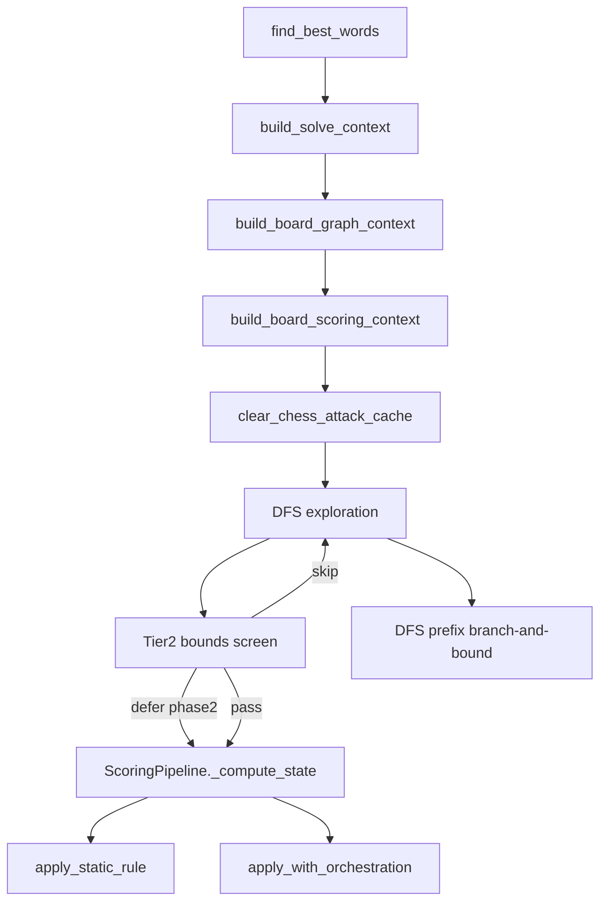

# Search and scoring architecture

Developer reference for the per-solve context stack, static/dynamic scoring split, and search optimizations introduced in the search/scoring performance refactor.

For profiling numbers and cache hit rates, see [`DATA_STRUCTURE_ANALYSIS.md`](DATA_STRUCTURE_ANALYSIS.md). For in-game scoring order vs wiki, see [`game-research/scoring-pipeline.md`](game-research/scoring-pipeline.md).

## Overview

Each **F8** solve builds three immutable context layers once, then runs DFS with automatic candidate screening:



**No user config keys** control these optimizations — they are automatic with gating. Test/dev overrides exist on `WordSearcher(use_tier2_screen=False, use_dfs_bb=False)`.

---

## 1. Per-solve context stack

Built at the start of `WordSearcher.find_best_words` in [`search.py`](../cursed_words_solver/search.py). Parallel workers in [`search_parallel.py`](../cursed_words_solver/search_parallel.py) build the same stack per worker.

### SolveContext — [`solve_context.py`](../cursed_words_solver/solve_context.py)

Immutable loadout snapshot via `build_solve_context(loadout, rules)`:

| Field | Purpose |
| ----- | ------- |
| `hourglass_reversed` | Whether item order flips before scoring |
| `shield_blue_base`, `microscope_base` | Tile init overrides |
| `search_flags` | Stamp movement/letter flags for DFS |
| `compound_percents`, `compound_finalize_at_cocktail` | Compound Cocktail session state |
| `inventory_refs` | Pin + sticker + stamp refs in scoring order |
| `sticker_slot_order`, `stamp_slot_order` | Slot iteration order (Hourglass-reversed) |
| `boss_ctx`, `active_boss_rules` | Boss scoring context |
| `capybara_shuffles` | Whether Capybara randomizes sticker/stamp order |
| `grid_tile_multiply_first` | Grid tile multiply ordering flag |
| `max_word_length_bonus`, `pin_word_bonus_per_tile`, … | Tier-2 bound bonuses |
| `tier2_screen_enabled` | Whether tier-2 screening is allowed for this loadout |

**Do not** re-query loadout flags inside the candidate hot path — read from `SolveContext` instead.

### BoardGraphContext — [`graph_bitboard.py`](../cursed_words_solver/graph_bitboard.py)

Per-board topology and scoring fields via `build_board_graph_context(board)`:

- `active_mask`, `letter_masks`, `wildcard_mask`, curse/color codes per cell
- `hanafuda_suit_mask`, `grid_base_score`, `coloured_tile_count`, `tile_base[]`
- Chess: `has_chess_pieces`, `knight_land_mask`, `king_step_mask`, `king_step_mask_wrap`

Static adjacency tables (`STANDARD_ADJACENCY`, `KING_STEP_MASK`, etc.) are module-level; `BoardGraphContext` is the per-solve layer on top.

### BoardScoringContext — [`board_scoring_context.py`](../cursed_words_solver/board_scoring_context.py)

Per-board+loadout precompute via `build_board_scoring_context(board, loadout, solve_ctx, graph_ctx, rules)`:

- `cell_masks` — bitmask per target label (`vowel`, `red`, `letter:X`, `colored_number`, …)
- `static_sticker_specs`, `static_stamp_specs` — classified static rules (see §2)
- `static_tile_add_by_phase` — per-cell sticker tile-add sums for tier-2 bounds
- `use_split_pipeline` — whether static fast path is active

When `use_split_pipeline` is false, the full dynamic orchestration path runs for every inventory rule.

---

## 2. Static vs dynamic scoring

Classification lives in [`rules/rule_phase.py`](../cursed_words_solver/rules/rule_phase.py).

### Static rule kinds

Rules that depend only on loadout + board (not path position or orchestration):

| Kind | Example stickers |
| ---- | ---------------- |
| `tile_add` | Sequoia Sapling (+vowel tiles) |
| `tile_mult` | Abacus-style letter/number multipliers (fixed factor) |
| `word_add` | Flat +WORD SCORE bonuses |
| `word_length` | Long-word bonuses |
| `red_tile_bonus` | Per-red-tile adds |
| `colored_number_add` | Coloured number tile bonuses |

Applied in O(path) via `apply_static_rule` before dynamic orchestration in `ScoringPipeline._compute_state`. Debug traces may show `detail: "static tile_add"`.

### Dynamic / orchestration exclusions

`classify_inventory_rule` returns `None` when:

- `effect_type` is in `ORCHESTRATION_TYPES`: Frankenstein, Overhand, RAM replay, shuffle/reverse order, scatter-start, blue-tile override, etc.
- Rule has a non-`always` condition
- Tile multiply uses scaled factors (`scale_by_pin_right`, `per_level_factor`, …)

### Split pipeline blockers

`blocks_split_pipeline()` forces `use_split_pipeline=False` when orchestration prevents safe interleaving:

- Capybara shuffle (`ctx.capybara_shuffles`)
- Compound Cocktail sessions
- Snapshot phased word scoring
- RAM pin
- Frankenstein sticker or Snapshot sticker equipped

**Contract:** [`tests/test_static_dynamic_pipeline.py`](../tests/test_static_dynamic_pipeline.py) asserts split-path scores match the full pipeline on representative loadouts.

---

## 3. Search optimizations

Implemented in [`fast_rank.py`](../cursed_words_solver/fast_rank.py) and orchestrated by [`search.py`](../cursed_words_solver/search.py).

### Tier-1 fast rank

Conservative lower bounds before any pipeline call:

- `fast_rank_lower_bound` — tile base sum only
- `mult_aware_lower_bound` — bases × guaranteed inventory mults from `loadout_mult_rules`

### Tier-2 two-phase screening

When `loadout_allows_tier2_screen()` is true, each candidate path is screened with optimistic/conservative bounds (`tier2_immediate_*`, `tier2_rank_*`) that include `SolveContext` word bonuses and static tile-add sums.

| Outcome | Action |
| ------- | ------ |
| Upper bound below heap minimum | **Skip** — no `score_total_only` call |
| Lower bound below heap min but upper bound could win | **Defer** — optimistic rank to heap; full score in phase 2 |
| Bounds pass | **Score** immediately via `_compute_state` |

Phase 2 re-scores `_provisional_candidates` that deferred in phase 1.

`loadout_mult_rules` in [`mult_search.py`](../cursed_words_solver/mult_search.py) accepts `solve_context=` so mult enumeration matches full scoring order.

### DFS branch-and-bound

During in-tree DFS, `prefix_dfs_rank_bound` uses prefix tile bases + static adds to prune branches that cannot beat the current heap minimum (`dfs_bb_prunes` counter).

### When optimizations are off

| Condition | Effect |
| --------- | ------ |
| No stickers and no stamps | Tier-2 disabled (`tier2_screen_enabled=False`) |
| Hourglass active | Tier-2 disabled |
| Compound Cocktail session | Tier-2 disabled; split pipeline blocked |
| Unsafe boss (beyond early bosses / steal-money) | Tier-2 disabled |
| Capybara shuffle | Split pipeline blocked |
| `setup_weight > 0` + setup stickers (Birthday Cake, Hi-Vis Jacket, …) | Tier-2 disabled (`tier2_setup_blocks_screen`) |
| Custom `score_fn` on `WordSearcher` | Tier-2 and DFS-BB disabled |

---

## 4. Chess and Hanafuda hot paths

### Chess — [`chess_tiles.py`](../cursed_words_solver/rules/chess_tiles.py)

- `clear_chess_attack_cache(has_chess_pieces=, board_fingerprint=)` runs once per solve; fingerprint computed only when `BoardGraphContext.has_chess_pieces` is true
- `is_square_attacked()` returns immediately on non-chess boards (no cache traffic)
- Knight/king neighbor generation uses `BoardGraphContext.knight_land_for` / `king_step_for` when `graph_ctx` is provided

### Hanafuda

- `unused_cards_on_board()` uses precomputed `hanafuda_suit_mask` from `BoardGraphContext` instead of scanning `board.flat` per candidate
- On the Hanafuda fixture (`20260526_231923`), `board.flat` calls dropped from ~86k to 4 per solve

---

## 5. Capybara

[`capybara_scoring.py`](../cursed_words_solver/rules/capybara_scoring.py) handles Capybara boss shuffle via permutation EV/min/max.

- `build_scoring_item_sequence` in [`scoring_order.py`](../cursed_words_solver/rules/scoring_order.py) **does not** apply Capybara shuffle — it uses `SolveContext.inventory_refs` in fixed order
- Each permutation rebuilds its own `SolveContext` (`capybara_shuffles=False`, updated `inventory_refs`) so the static fast path stays correct per perm

---

## 6. Instrumentation

`SearchTiming` (returned on `WordSearcher.last_search_timing`) reports wall-time breakdown and optimization counters:

| Field group | Meaning |
| ----------- | ------- |
| `wall_sec`, `dfs_sec`, `score_sec`, `chess_sec`, `extend_sec` | Phase wall times |
| `score_pct`, `explore_pct` | Scoring vs exploration share |
| `score_cache_hits/misses` | `(path, word)` score memoization |
| `dict_path_cache_hits/misses` | Path → resolved word during scoring |
| `chess_attack_cache_hits/misses` | King-check attack memoization |
| `board_flat_calls` | Direct `.flat` property accesses |
| `trie_fast_accepts`, `trie_steps`, `trie_prunes` | Trie DFS pruning |
| `tier2_screen_skips` | Candidates skipped by bounds (no score call) |
| `tier2_rank_screen_skips` | Additional rank-bound skips |
| `tier2_phase1_calls`, `tier2_phase2_calls`, `tier2_phase2_deferred` | Two-phase scoring flow |
| `dfs_bb_prunes`, `dfs_bb_calls` | In-tree branch-and-bound |
| `grid_refs_cache_hits/misses` | Per-path grid scatter ref cache |

`tier2_recommendation()` returns a heuristic string based on `score_pct` and sticker count.

### Profiling commands

See [`scripts/README.md`](../scripts/README.md):

```bash
python scripts/profile_search.py tests/fixtures/mismatches/20260526_231923.json --budget 12
python scripts/analyze_data_structures.py --budget 12
```

---

## 7. Test map

| Test file | Contract |
| --------- | -------- |
| [`test_static_dynamic_pipeline.py`](../tests/test_static_dynamic_pipeline.py) | Static classification; split pipeline score parity |
| [`test_tier2_two_phase.py`](../tests/test_tier2_two_phase.py) | Bounds bracket full score; grid-ref cache |
| [`test_search_performance.py`](../tests/test_search_performance.py) | Tier-2 gating matrix; `use_tier2_screen` preserves results |
| [`test_graph_bitboard.py`](../tests/test_graph_bitboard.py) | Chess neighbor mask parity |
| [`test_solve_context.py`](../tests/test_solve_context.py) | Precompute-once fields match individual lookups |
